# Techniques avancees de gestion de projets

## Démarrer un projet informatique

Quelle aventure excitante la formation et le démarrage d’un projet informatique ! On a tous en mémoire le vécu d’un projet dont on conclut : « ça a été une période intense ! » ou encore « oh la, il y a eu tellement d’embûches ! » mais aussi « on a réussi à livrer dans les temps ».

Quelle que soit la durée du projet, de quelques jours à plusieurs mois, le récit dépend beaucoup du point de vue. Le commanditaire minimise la complexité de la demande pour focaliser sur les bénéfices apportés par les résultats du projet. Le chef de projet est naturellement beaucoup plus à même de souligner les contraintes à surmonter. L’un et l’autre sont en rapport, c’est même la définition de la création de valeur qui est présentée au chapitre Les aspects financiers et juridiques.

La réussite du projet est-elle une grande responsabilité ? Tient-elle de l’exploit, de la chance, d’un savoir-faire particulier ? Il y a un peu de tout cela, une combinaison de l’organisation avec d’autres disciplines, autant de rôles que le chef de projet va incarner tel un chef d’orchestre.

Le chef de projet imprime tout d’abord le rythme, c’est lui qui démarre la réalisation et donne le top départ du lancement des activités.

C’est aussi lui qui veille au respect de la fréquence des échanges entre les parties prenantes tout au long du projet. Voilà un point capital pour éviter les malentendus souvent lourds de conséquences : besoin incomplet ou mal défini, enjeux et objectifs non formulés, équipe de réalisation fonctionnant dans une tour d’ivoire, client laissé dans l’ignorance des événements notables du projet.

Tout projet comprend une part personnelle apportée par les membres de l’équipe. Le chef de projet n’est pas seulement un gestionnaire du planning ; c’est d’abord un manager qui entretient et maximise la motivation pour aboutir. Il veille à la bonne tenue du cap, au respect du cadre et à la bonne entente au sein de l’équipe.

Démarrer un projet, rien de plus simple : identifier les enjeux puis formuler les objectifs. Cette démarche est à la fois le point de départ du projet mais aussi son horizon d’arrivée. L’équipe va se frayer un chemin entre ces deux situations, suivant un itinéraire unique.

### Identifier les enjeux

L’identification des enjeux est la première étape, elle est primordiale. Quelles sont les motivations pour engager ce projet ? Qu’est-ce qui est important par différence avec ce qui est secondaire ? Quels sont les critères pour réussir le projet ?

Il n’y a pas de méthode infaillible pour répondre à ces questions, d’autant que des projets sont formés dans des situations très diverses : lancement de produit ou de service, appel d’offres, plan d’action… Les causes sont grandes ou petites, et l’identification des enjeux tout aussi nécessaire.

Considérons un projet de taille significative. Sans enjeu déterminé, l’engagement des moyens - équipes et ressources - sera forcément limité. Ceci constitue déjà un risque d’échec élevé.

Mais les petits projets doivent également identifier leurs enjeux, sous peine de privilégier la réalisation au détriment de l’organisation et du pilotage.

Le plus souvent, les enjeux d’un projet entrent dans un cadre stratégique d’entreprise ou d’organisation : renforcer des positions commerciales, attaquer de nouveaux marchés, transformer l’organisation, rationaliser, nouer des partenariats, fidéliser des clients, développer des usages…

Il est généralement admis que la liste comprend deux à quatre enjeux majeurs ; naturellement, il ne s’agit pas d’une règle absolue. Un seul enjeu peut avoir du sens si on vise « assez loin » pour ne pas se lancer dans du trop spécifique. Inversement, trouver une multitude d’enjeux principaux pose la question de l’étendue du projet et de la granularité de ses objectifs.

La liste des enjeux peut faire référence à la stratégie suivie par l’organisation (par exemple « être numéro un sur notre marché »), elle peut contenir des éléments chiffrés (« diviser par deux le nombre d’anomalies annuelles ») ou mentionner un dispositif existant (« ce panel fournit des indicateurs depuis cinq ans »).

Exemples :

- Fiabiliser la mesure de satisfaction des usagers concernant la qualité de service.

- Maximiser l’indice de satisfaction concernant la qualité de service.

- Rendre compte aux usagers de l’évolution de l’indice de satisfaction et des actions réalisées.

### Formuler les objectifs

Les objectifs du projet fixent dans les grandes lignes les besoins en reformulant les enjeux des réalisations à venir. Définir les objectifs, c’est répondre à la question : « que veut-on obtenir ? ».

À ce stade, on évoque le futur produit mais on ne parle pas encore de la façon d’y parvenir. Soulignons que même dans le cadre des méthodes agiles qui s’accommodent fort bien d’un besoin évolutif (voir le chapitre Rendre les projets agiles), il existe une étape de projection vers un résultat recherché, et ceci à chaque sprint (voir le chapitre Rendre les projets agiles).
Cette démarche de projection fait donc abstraction des contraintes habituellement mises en avant par les équipes de réalisation ; au contraire, conditionner l’atteinte d’un objectif à telle ou telle difficulté a pour conséquence d’introduire des facteurs de surcoût dès le début du projet.

L’énoncé des objectifs est à la fois simple - puisque l’on doit s’affranchir des contraintes - mais n’est pas naturel. Les équipes de réalisation ont tendance à s’autolimiter, tout comme les demandeurs, de peur d’obtenir une estimation (également appelée chiffrage) astronomique, laquelle remettrait en cause l’ensemble du projet.

Exemples :

- Publier les rapports de satisfaction de qualité de service.

- Mesurer la satisfaction de qualité de service après chaque transaction.

- Comparer les indicateurs de satisfaction de qualité de service d’une année sur l’autre.

### Définir le périmètre

Voici l’étape qui installe le projet dans son cadre. Le périmètre du projet définit sa portée, ses limites théoriques en quelque sorte, et on précise pour cela ce qu’est le projet, ainsi que ce qu’il n’est pas.

Comment procéder ?

Une première approche consiste à lister ce qu’est le projet, en détaillant (un peu) les objectifs, puis à lister quelques éléments réputés hors périmètre. Cette méthode, qui peut paraître empirique, est néanmoins employée dans nombre de cahiers des charges et autres appels d’offres, preuve s’il en est de son efficacité en dehors de tout formalisme standardisé.

Une deuxième approche nécessite de réaliser une estimation grossière pour calibrer le projet, déterminer son coût approximatif, sur la base d’un nombre de jours de réalisation ou d’un budget financier plus étayé. Toutes les techniques d’estimation sont pertinentes à ce stade, par comparaison, par analyse, par abaque… Même dans le cas des projets évolutifs ou agiles, on devra de toute façon encadrer le nombre de jours consacrés au projet.

L’estimation du nombre de jours à passer sur le projet est déterminante.

D’une part, elle donne une indication sur l’étendue des demandes. A-t-on suffisamment de matière pour déclencher un projet ? Et aussi, n’a-t-on pas vu trop grand ? D’autre part, l’estimation va être convertie en montant financier, c’est l’enveloppe nécessaire à la réalisation du projet. Si le budget n’est pas garanti, alors le projet ne pourra pas se faire. L’estimation des charges fournit aussi une indication du temps que mettra l’équipe pour réaliser le projet avec un niveau de qualité standard, c’est-à-dire en disposant de périodes de spécifications, de tests, de documentation…

Quel est le bon équilibre entre l’étendue des demandes, le délai de réalisation, le coût du projet et le niveau de qualité ? Cela peut varier d’un projet à l’autre en fonction des enjeux du projet. On peut privilégier le délai de réalisation pour sortir rapidement un nouveau produit ou bien insister sur la qualité ou la richesse fonctionnelle pour se démarquer d’un produit existant. Le coût peut être aussi un élément primordial du projet.

La matrice QCD (Qualité, Coût, Délai) représente ces différentes dimensions. On ne peut pas tout optimiser simultanément, mais si on fixe certaines exigences, alors les autres sont des axes de compensation (trade-off) pour rendre l’équation soluble.
Le coût dépend beaucoup du délai global pour mener le projet ; mais des périodes où l’activité est réduite peuvent être mises à profit pour diminuer le nombre de personnes affectées au projet et en fin de compte réaliser des économies sur le long terme.

Le niveau de qualité exigé sur le produit du projet influe à la fois sur les délais et sur le coût. Il faut envisager la qualité comme un niveau de performance à atteindre et pas seulement comme un nombre de défauts plus ou moins visibles, voire acceptés.

Exemples :

Dans le domaine réglementé des logiciels financiers, la fiabilité des résultats est de rigueur.

L’équipe dispose de six mois pour réaliser le projet de création d’un module de calcul d’amortissements, ce qui paraît adéquat pour une charge estimée à quatre-vingts jours-hommes. Plusieurs algorithmes de calcul sont disponibles sur le marché, certains sous licence commerciale se montrent très efficaces pour fournir instantanément leurs résultats.

La priorité doit être donnée à la maîtrise du budget et à la fiabilité des calculs, mais la vitesse des calculs n’est pas l’exigence première.

## Elaborer le projet

### Dimensionner le projet

On se rapproche tout doucement de la phase operationnelle du projet. C'est le moment de proceder au casting de l'equipe de realisation.

Loin de se limiter à la question du délai global, le dimensionnement se préoccupe de bien d’autres domaines comme les compétences requises, le contexte particulier (économique, stratégique, réglementaire…), le degré d’industrialisation ou au contraire la part de recherche et développement.

Dimensionner le projet, c’est prévoir quelles ressources seront affectées sur quelles durées.

On parle en premier lieu des ressources matérielles (ordinateurs, serveurs, d’autres types d’équipement), d’actifs logiciels (licences, applicatifs) ou encore de services logiciels (stockage, entrepôts de code sources, services Cloud…).

Le chef de projet va commencer à répertorier et orchestrer l’emploi de ces ressources, cela va servir de base à la construction du budget.

Pour mener à bien cette cartographie des ressources, le chef de projet définit l’échelle temporelle : le délai global du projet se compte en jours, en semaines, en mois ou en années. L’affectation des ressources et leur coût unitaire se fait en minutes, en jours, en semaines, etc. Cette échelle est variable d’une ressource à l’autre, certains services SaaS (software as a service, accès locatif à des services logiciels) sont facturés à la seconde tandis que l’acquisition d’un serveur de calcul peut être amortie sur plusieurs mois.

Exemple d'estimation :

Le chiffrage atteint 240 jours à fournir avec une équipe de 6 personnes affectées à temps plein sur le projet. En moyenne, chaque personne travaillera 240 / 6 = 40 journées. Empiriquement, la durée du projet est de 40 / 5 = 8 semaines de réalisation.

À partir de cette base théorique où toutes les tâches sont indépendantes et peuvent être réalisées en parallèle, le chef de projet précise le plan de charge. De façon plus réaliste, la durée du projet s’allonge de deux à trois semaines pour tenir compte notamment des dépendances entre tâches et de la disponibilité individuelle des équipiers.

### Constituer l'équipe

La constitution de l’équipe projet est une affaire de personnes, d’alignement des compétences entre les besoins et les disponibilités, mais aussi un acte de management. Réunir une équipe, c’est fédérer des compétences autour d’un projet et entretenir la motivation pour atteindre ses objectifs.

Or, certains rôles complémentaires ont des modes de fonctionnement parfois opposés : le développeur code rapidement tandis que le testeur prend le temps d’éprouver une à une les fonctionnalités. Dans son rôle de leader, le chef de projet est à la fois le gardien du niveau de qualité défini (au sens de la complétude des livrables et de leur conformité) mais aussi le manager d’une équipe.

Sans concéder aux exigences de qualité et de performances, la constitution de l’équipe tient compte des personnalités et du respect d’un « savoir travailler » ensemble. Il y a ainsi des combinaisons de personnes qui fonctionnent mieux que d’autres.

La taille de l’équipe dépend beaucoup de l’organisation (de l’entreprise) en charge du projet ; toutes les compétences sont-elles disponibles ? Des recrutements sont-ils nécessaires et envisageables, en embauche ou en prestation ? Le recrutement, y compris d’un prestataire, peut prendre du temps et retarder le projet. Dans certains cas, le chef de projet doit bien entendu prendre un risque calculé en prenant en compte la durée du projet, les coûts de personnel et les compétences nécessaires à la réalisation du projet.

Exemple :

Ce projet de développement logiciel réclame des compétences métiers spécifiques. Trois personnes dans l’organisation sont identifiées pour participer. Jocelyn est un expert, il a une vision très claire du métier, il est reconnu pour ses compétences mais se montre parfois intransigeant si on n’adhère pas entièrement à son point de vue. Romy a rejoint l’entreprise l’an dernier, elle n’a pas encore participé à des projets de ce type mais elle s’est montrée très intéressée lors de la présentation du projet. Enfin, Khalid est une valeur sûre, rompu à la réalisation de ce type de solutions mais très sollicité, il est en quelque sorte victime de son succès !

Le chef de projet pourrait d’abord proposer à Romy de rejoindre l’équipe. Bien que moins expérimentée, sa motivation sera un atout. Par ailleurs, il serait dommage que Khalid accepte de participer alors que ses autres projets l’accaparent. Enfin, il a été porté à la connaissance du chef de projet que Jocelyn ne s’entend pas avec l’équipe de développement.

### Commencer le projet

Qu’est-ce qui matérialise le projet ? Ce n’est pas la production de livrables ou la distribution de consignes ni même l’établissement d’un planning. Il faudra bien s’y mettre, mais un projet n’existe pas sans gouvernance et sans moyens d’atteindre l’objectif.

La gouvernance du projet constitue son cadre de décision, c’est une convention passée avec les parties prenantes. Le chef de projet est chargé de piloter des ressources (humaines, matérielles, budgétaires) engagées pour réaliser quelque chose. La gouvernance fixe les règles du jeu et en particulier les instances de pilotage du projet. On parle parfois de comitologie pour définir les réunions, les participants, les objectifs, les moyens…
Quand la convention de gouvernance est passée, elle s’applique aussitôt ; le projet démarre.

## Cas d'etude pour les exemples de cours

### Cas d'étude : projet de mise en place de CRM

CRM: Customer Relationship Management

#### 1. Contexte

La Société de **Conseil Plus** compte deux-cents personnes sur deux sites implantés dans de grandes villes, capitales économiques de leurs régions respectives. Les associés exercent une activité exécutive et en même temps opérationnelle. La société dispense des conseils aux professionnels, aussi les associés disposent d’une relative autonomie dans le développement de leurs affaires. La présidence tournante au sein du comité de direction vient de changer, et celle-ci, sur la recommandation de la direction administrative et financière, a fait le choix stratégique d’attaquer un nouveau marché du conseil.

Ce choix implique le développement rapide de réseaux de clients et de prescripteurs, ainsi qu’une transformation rapide des opportunités en vente. La rentabilité viendra du volume d’affaires réellement mis en œuvre, chaque opération pouvant représenter plusieurs dizaines de comptes qui aujourd’hui sont traités un par un.

La direction administrative et financière comprend le secrétariat général, le service communication et le service marketing. Les activités de conseil sont organisées en pôles, dirigés par des associés.

La direction générale a chargé la DAF (directrice administration et finances) de mettre en œuvre la constitution d’une base de données « gestion de la relation client » qui soit orientée vers le développement de réseaux et l’analyse d’opportunités.

2. Besoin exprimé

La DAF a tenté de structurer par elle-même une base de données des contacts transmis par les associés dans leurs opérations de prospection (des cartes de visite, des mémos, des mails…), mais aussi à partir du fichier client. Il en résulte un listing comprenant plusieurs milliers de contacts, en grande majorité peu qualifiés. De plus, le circuit d’acquisition et d’enrichissement n’est pas bien rodé, et de nombreux contacts font l’objet d’un traitement manuel (qualification, mise à jour, recoupement, recherche d’antériorité, suppression des doublons…).

Durant le dernier comité de pilotage, la DAF a recommandé d’orienter le projet sur une autre approche, la mise en œuvre d’un outil de CRM, dans le but évident de ne pas réinventer quelque chose qui existe par ailleurs. Outre les fonctionnalités standards d’un tel outil (gestion des contacts, analyse multicritère, suivi des opérations commerciales…), des critères de simplicité et d’efficacité, de polyvalence, d’intégration avec les outils bureautiques et les équipements mobiles ont été retenus.

Le projet piloté par la DAF est confié à Annie, responsable du marketing, laquelle est nommée chef de projet.

3. Cadre du projet

Des consultations sont lancées auprès d’éditeurs de logiciels et d’intégrateurs de solutions CRM. Le comité de pilotage a proposé une mise en œuvre dans les six mois qui suivent la sélection d’un fournisseur. Le processus de sélection est prévu pour une durée de deux mois.

La DAF n’a pas encore budgété cette opération qui se déroulera sur le prochain exercice. Elle envisage de consulter trois à quatre prestataires et de mettre en compétition les deux meilleurs suivant la méthode dite de dialogue compétitif.

La chef de projet sera assistée de Guillaume, responsable système, employé par une société de services informatiques détenue partiellement par la Société de Conseil Plus.

Annie et Guillaume entreprennent la rédaction d’un cahier des charges reprenant les besoins fonctionnels identifiés ainsi que les contraintes techniques connues. Ce document d’une quinzaine de pages a été soumis à la DAF avant que les premiers contacts soient initiés auprès des fournisseurs potentiels.

4. les enjeux du projet

La décision stratégique d’investir de nouveaux marchés résulte de l’analyse d’un business qui évolue. Les interactions sont plus courtes et plus fréquentes. Hommes d’affaires aguerris, les associés sentent le vent tourner et veulent capter un marché structuré qui pourrait se déliter en petits morceaux, faisant les beaux jours d’acteurs éphémères et nettement moins importants. La présidence compte bien assoir la société sur la plus haute marche du podium et conforter sa place de leader au sein du board.

Avisée, la DAF réalise l’impérieuse nécessité d’améliorer la productivité dans un domaine resté jusque-là très indépendant des processus habituellement sous son contrôle. C’est aux associés que revient la tâche de développer les affaires, c’est à la DAF de fournir des outils adaptés. De fait, la détermination de la rentabilité (ROI ou Return On Investment) sera délicate à établir et à partager avec le board.

Annie, la chef de projet, a vite décelé l’opportunité d’élargir son champ de responsabilité, y compris après le franchissement de l’étape lancement. Guillaume, même s’il ne perçoit pas la visée stratégique du projet (celle-ci n’a pas été dévoilée en dehors du board), y voit un moyen de renforcer la coopération entre son entreprise et la Société de Conseil Plus, à la fois actionnaire et cliente.

### Cas d'étude : developement d'une application de pilotage

4U Production est une maison de production web fonctionnant par crowdfunding (financement participatif). Elle met en relation des internautes dans le but de financer des productions d’œuvres artistiques digitales. Lancée il y a quatre ans par un duo d’entrepreneurs audacieux, JP et Dan, la compagnie de production a connu ces derniers temps un essor fulgurant. Afin d’étoffer ses effectifs permanents, trois nouveaux cadres ont été recrutés.

François est directeur des opérations, il est en charge de l’administration des ventes (encore embryonnaire) et de l’organisation des événements de promotion.

En tant que directrice de projets, Samantha a la responsabilité de suivre la réalisation des œuvres ; elle veille à ce que l’argent des internautes soit réellement dépensé pour leur production. Son quotidien est donc fait de réservations de studios d’enregistrement et de postproduction, de commandes de galeries digitales et de rendez-vous avec les artistes.

William est le nouveau patron des commerciaux. Il vient du monde de la presse en ligne où il a dirigé des régies publicitaires. Il va maintenant établir des dossiers de partenariat entre internautes et artistes, récupérant pour l’entreprise un pourcentage des fonds collectés et prévoyant des événements de promotion sponsorisés par d’authentiques clients.

a. Analyse de la situation et perspectives
Les fondateurs, JP et Dan, sont des marketeurs de haut vol, passionnés par leur métier, débordants de nouvelles idées et de projets à enclencher. Mais l’embauche de nouveaux talents a été conduite à marche forcée afin de ne pas perdre prise avec la réalité des affaires. Samantha, François et William ont de grandes qualités professionnelles, cependant leurs méthodes de travail sont très éloignées les unes des autres.

Samantha a travaillé longtemps comme freelance avant de rejoindre l’équipe exécutive. De cette époque, elle a conservé ses tableurs et ses cahiers pour assurer le suivi de ses projets. François est un administrateur né, il a l’habitude de planifier et dérouler ses opérations sans admettre la moindre entorse aux procédures et dispositifs. William est un directeur des ventes expérimenté, flairant les opportunités et assez à l’aise vis-à-vis des procédures trop contraignantes. Avec lui, pas moyen de rater une affaire !

JP et Dan n’organisent pas systématiquement de grandes réunions formelles à horaires fixes, mais ils ont cette fois convié tout le monde autour de la table. Il va falloir s’organiser, et rapidement. Autrement, l’entreprise ratera son passage en mode industriel, sans visibilité sur sa rentabilité et ses perspectives.

Il est décidé de développer un outil de pilotage d’activité maison qui soit utile à l’ensemble du personnel permanent. Jérôme, qui travaillait jusque-là comme webdesigner intérimaire, se voit proposer un poste permanent avec un élargissement de sa mission : il est promu chef de projet de l’application pilotage d’activité ! Les fondateurs annoncent également l’arrivée d’un directeur juridique qui a travaillé dans un grand cabinet d’audit et de conseil. Bien que missionné pour le contentieux et les affaires juridiques de l’entreprise, sa réputation le précède et on sait déjà qu’il a des idées très précises sur la gestion des processus d’entreprises.

b. Résumé des exigences
JP et Dan souhaitent avoir une vision prospective de leurs affaires, tandis que François a besoin de connaître en temps réel la situation des opérations en cours. Après réflexion, les besoins de Samantha et William sont similaires, toutes les opérations et négociations seront intégrées à cet outil.

Il est convenu qu’une petite entreprise telle que 4U Production s’épargnera la mise en œuvre d’un système ERP (Enterprise Resource Planning, ou progiciel de gestion intégré), réputé complexe à déployer. Les dirigeants, très créatifs, optent plutôt pour la production d’indicateurs numériques et graphiques.

Les indicateurs, actualisés périodiquement, seront affichés sur de grands écrans aux endroits clés des bureaux de l’entreprise, salle de réunion créative, cafétéria, et sur la première page de l’intranet.

c. Dotation et contraintes
Les dirigeants conçoivent un projet à leur image, entrepreneurial, rapide et qui ne sollicite pas trop la trésorerie. Jérôme dispose de trois mois pour le réaliser, et doit s’organiser à mi-temps, poursuivant ses travaux d’infographie en parallèle. Il aura l’appui du personnel permanent qui a reçu comme consigne de consacrer au moins une journée par semaine aux différents ateliers.

Le développement informatique sera confié à une équipe constituée de freelances déjà en place et habituellement pilotée par Jérôme.

d. Les enjeux du chef de projet
Chacun tient malgré tout à son indépendance, et la mise en commun des informations de suivi ne rime pas avec une normalisation des processus. C’est un point que devra surveiller Jérôme s’il veut que le projet aboutisse. D’autant que Hubert, le nouveau directeur juridique, semble bien tenté d’apposer sa patte sur le fonctionnement de l’organisation.

Jérôme a d’ailleurs été retenu comme chef de projet car il connaît déjà bien le fonctionnement de l’entreprise et ne cherchera pas à transposer un modèle issu d’une autre expérience professionnelle. Mais il va devoir prendre du recul, s’investir dans de nouveaux domaines, analyser les méthodes de chaque directeur et trouver une cohérence dans le rendu des indicateurs sans pour autant renoncer aux particularités.

Chaque directeur suit son propre rythme, ajoute ses contraintes, dispose déjà de ses indicateurs, et le chef de projet comprend ainsi le sens de sa mission : trouver une organisation qui fédère et rationalise différentes approches ad hoc du pilotage.

C’est donc un projet dans lequel la dimension métier et le relationnel sont au premier plan. Plus coutumier de projets à dominante technologique, Jérôme dispose d’un tremplin pour progresser.

### Creation d'un site e-commerce

Stéphanie a passé plusieurs années dans une ESN (entreprise de services du numérique) de renommée mondiale. Elle y a occupé différents postes jusqu’à obtenir celui de manager. Fonceuse et charismatique, son équipe n’a pas hésité à la suivre lorsqu’elle a annoncé son départ pour fonder le site de vente en ligne On’Troc.

Son projet est le fruit d’une discussion impromptue avec Yves, un dirigeant de la société de services, qui lui a fait découvrir le modèle économique des startups et indiqué que des fonds pourraient être injectés par l’incubateur si elle présentait un cas d’affaire (business case). Quelques nuits de travail acharné plus tard, le plan était cadré et étudié en avant-première par Yves. Celui-ci observa que le projet de Stéphanie était à la fois audacieux, excitant et prometteur. Le fonds d’investissement serait prêt à débloquer des sommes conséquentes pour s’associer à l’essor commercial de la société dirigée par Stéphanie.

Yves a mis Stéphanie en contact avec Ernest, consultant senior détaché du fonds d’investissement chargé d’affiner le projet. En effet, l’apport des conseils relatifs à la création de l’entreprise, son établissement et le recrutement d’une équipe sont aussi déterminants que la levée de fonds.

a. Des moyens conséquents au service d’un projet unique
Revenons au projet : le capital investi est assez important pour assurer deux ans de trésorerie avec cinq salariés. Toutes les prestations de recherche et développement de ventes sont sous-traitées pour ne pas représenter de charges fixes. Des locaux confortables et fonctionnels sont loués afin d’établir le siège social et d’accueillir collaborateurs, partenaires et fournisseurs.

Les formalités de création de l’entreprise sont bouclées assez rapidement par Ernest, qui conduit la plupart des opérations administratives. Stéphanie se concentre sur la composition de son équipe. Ses collaborateurs actuels sont tellement performants qu’elle espère en débaucher un ou deux. Elle constate avec satisfaction que bien plus de candidatures issues de son équipe lui sont adressées.

Secrétaire général officieux, Ernest a procédé à la rédaction des contrats de travail et il a recommandé une structure de rémunération très stimulante en regard de ce projet unique : la création d’une entreprise.

b. De la stratégie au plan projet
Stéphanie doit maintenant présenter le détail de sa stratégie et trouver avec son équipe un plan de réalisation adéquat. De nombreuses projections financières sont nécessaires, et quelques-unes d’entre elles sont validées par le fonds d’investissement. Le capital n’est en effet pas complètement libéré et un contrôle très strict des engagements financiers est opéré par l’incubateur. Celui-ci fait un peu office de banquier et il entend compenser les risques pris par une visibilité sur la rentabilité de l’affaire.

Au bout de quelques semaines, le plan se dessine et la proposition de valeur est détaillée au comité d’investissement. Suivront des études de marché et de nombreuses séances de simulation avant de pouvoir enfin envisager la phase de réalisation.

Lorsque le lancement officiel a été prononcé, l’équipe, euphorique, s’est rapidement mise à la tâche. Enfin du concret !

c. Les enjeux d’une équipe
Les collaborateurs de Stéphanie ne sont pas venus chez On’Troc par hasard. Ils ont été attirés par le défi de la création d’une entreprise où l’esprit pionnier est une valeur partagée, où tout est à inventer.

Cependant, cette entreprise nouvelle est détenue par un groupe puissant et structuré. L’équipe va devoir composer avec les contraintes d’un contrôle financier très strict et trouver rapidement sa marge de manœuvre afin d’atteindre les objectifs qu’elle s’est fixés.

Dans cet enchaînement d’étapes et de décisions, le but initial de Stéphanie s’est sans doute transformé. Partie pour « monter une affaire », elle doit maintenant se positionner comme chef d’entreprise et veiller à la pérennité de celle-ci.

Venus offrir leurs compétences opérationnelles, ses collaborateurs ont l’opportunité d’évoluer et de devenir de futurs directeurs. Les caractères et les ambitions personnelles vont bientôt se révéler. Il faudra à Stéphanie de la clairvoyance, elle devra compter sur toutes ses qualités de manager pour offrir le meilleur à sa nouvelle équipe.

### Creation d'une appli Sport

Quatre copains poursuivent le même but, se lancer des défis sportifs relevés. Ils ont tout essayé ou presque : le kitesurf, le ski de randonnée, la plongée sous glace, le trek en altitude… Désireux de partager et de monétiser leurs découvertes, la petite entreprise fondée il y a quinze mois est déjà très productive. Le nombre d’abonnés aux posts spectaculaires dévoilant des spots inédits attire déjà des sponsors.

a. Le défi d’une bande de passionnés
Assez rapidement, l’idée d’un moyen de communication électronique s’est imposée. Comment proposer des lieux originaux, élargir le nombre de sites visités sans avoir à recruter et à financer de coûteuses collaborations ? La priorité est de disposer d’une application pour mobiles, seul support vraiment adapté. Toutefois, les contours du projet de développement ne sont pas précisément arrêtés.

L’équipe, constituée de deux informaticiens et de deux commerciaux, s’est mis en tête de transformer cette expérience en revenus financiers. Dans une phase pionnière, le niveau de rentabilité attendu est assez facile à atteindre.

Pour résumer le cas d’affaires, il s’agit d’un développement informatique où tout est à inventer, à définir, et pour lequel les contraintes sont contournées plus que parquées dans des listes à épuiser dans de laborieuses réflexions.

b. Un projet à la mesure de sa communauté
L’équipe est convaincue que la valeur du projet tient dans la rapidité de sa croissance. Autrement dit, le code source est accessible dans le cadre d’un contrat de licence open source, et la communauté de développeurs devient le levier d’accélération. Ce principe de développement privilégie tout naturellement une organisation agile pour un projet en constante évolution, dont le périmètre correspond à la somme de ses contributions.

c. Développer et grandir avec la technologie
Dans un tel projet, les changements de cap sont fréquents et s’accompagnent de ruptures technologiques, de modifications radicales de la pile technique (ensemble des frameworks et composants logiciels qui composent l’architecture). La maîtrise du risque au sens informatique devient un élément central de pilotage. La valorisation de cette jeune entreprise dépend d’ailleurs largement de sa capacité à faire aboutir le projet.

## Aspects financiers et juridiques d'un projet

### La structure de cout d'un projet

Que l’on imagine un projet se dérouler au sein d’une société de services informatiques, chez un éditeur de logiciels, un intégrateur ou toute autre structure, les conditions économiques et financières sont omniprésentes et sous-tendent l’intégralité de l’activité. On a coutume de dire « pas de budget, pas de projet » pour rappeler que nul projet ne peut exister sans dotation.

Le chef de projet est au centre d’un dispositif qui consomme des ressources pour atteindre un but. Ce qui est finalement livré représente une valeur perçue par le commanditaire du projet. S’il s’agit d’un logiciel, celui-ci est par exemple vendu à ses utilisateurs et le commanditaire reconnaît un montant financier compatible avec les efforts et les espoirs (rendement) qui ont rendu possible la réalisation du projet.

Le cas des ouvrages « internes » n’est pas différent et, là encore, le chef de projet assure une double charge. Il doit d’abord évaluer l’ensemble des charges financières du projet (réalisation, exploitation, maintenance…) pour le comparer à ce qui pourrait être obtenu grâce à un dispositif externe. Il doit ensuite gérer au mieux son projet pour le conduire conformément aux prévisions.

La structure de coût projette sur un horizon temporel des postes de coûts fixes ou récurrents. L’échelle de temps dépend de la durée du projet, incluant l’exploitation de son produit, voire les réinvestissements.

a. Les salaires et prestations de réalisation
Ces postes représentent fréquemment jusqu’à 75 % des coûts d’un projet, en tous les cas sur la première année et jusqu’à ce que le produit rentre en maintenance. On considère généralement des montants chargés (+65 % du montant net) pour les salaires internes et des montants incluant les marges (markup) quand on se trouve du côté SSII (société de service et d’ingénierie informatique).

À compétence égale, le coût d’une SSII est un peu supérieur puisqu’il intègre la marge commerciale ainsi qu’une marge assurant le prestataire en cas d’intercontrats. Le markup (taux de marge) global se situe fréquemment à 1,6 (60 % plus important qu’un salaire). L’intercontrat - la période au cours de laquelle les ressources ne sont pas en mission - est une composante du risque qui peut servir de levier pour négocier un projet.

Des grilles de coûts

Les coûts d’une ressource dépendent des éléments suivants :

Le domaine de compétence (développeur, administrateur, architecte, graphiste…).

Le niveau de qualification et le degré d’expérience (débutant, confirmé ou expert).

Le champ d’application des compétences au sein du projet (c’est-à-dire l’adéquation entre les compétences proposées et les besoins du projet, ou encore le degré de connaissance de l’objet du projet).

Le salaire de la ressource (peut être lié à la durée de la carrière).

Le niveau de service pour le projet.

Les modalités d’emploi (sur site en régie, au forfait, en offshore - à l’aide d’une équipe délocalisée…).

Le chef de projet peut consulter des barèmes, publiés par la presse informatique ou par les cabinets de recrutement, pour situer sa structure de coûts ; ces grilles de coûts sont périodiquement actualisées et sont une base importante pour évaluer la fiabilité d’un chiffrage.

b. Négocier les coûts journaliers en régie
La négociation doit s’effectuer lorsque le périmètre exact du projet est connu, car le coût est principalement lié au nombre de jours nécessaires à sa réalisation. La durée de l’engagement est un levier de négociation important : meilleure est la visibilité du prestataire sur le plan de charge futur de ses ressources, moins l’hypothèse d’intercontrats est justifiée. On peut donc gagner jusqu’à 20 % du prix jour par ce biais. Pour arriver à ce résultat, le commanditaire peut chercher à mutualiser ses commandes pour allonger la période d’intervention du prestataire.

Puisqu’en régie tous les paramètres sont connus et partagés par les parties - prestataire et commanditaire - ce dernier peut ajuster le prix en modulant ses exigences : qualité des intervenants, niveau de service, modalités d’exécution…

La démarche de négociation doit rester équilibrée et source de valeur pour toutes les parties ; le cas d’un périmètre incertain, d’une impossibilité à aligner des profils adéquats, des indisponibilités de planning, etc. conduira à une impasse commerciale, sinon à de grandes difficultés lors de la réalisation du projet qui s’interrompra en échec.

c. Négocier les prestations au forfait
Le cas des prestations au forfait est un peu plus délicat car le risque est souvent l’inconnue de l’équation du commanditaire. À périmètre identique, celui-ci peut recevoir des propositions à des montants différents, selon l’appréciation du risque et selon sa répartition entre le prestataire et le commanditaire.

La démarche de négociation vise à identifier la part de risque du projet et à modifier sa répartition entre les parties. Ainsi, la principale variable d’ajustement est le niveau de service (on dit aussi niveau d’engagement ou service level agreement - SLA).

Le commanditaire doit donc surveiller les éléments clés de la proposition :

Les périodes de récupération sur le planning (si elles sont inexistantes, le risque lié à un retard est plus important et une clause prévoit sans doute des rétro-pénalités ou des limitations de responsabilité et de service).

Les métriques pour franchir les jalons (nombre d’anomalies, périodes de décompte des anomalies, livrables…).

La répartition des rôles au cours des phases du projet (formulées comme des exigences du prestataire vis-à-vis du commanditaire quant à la fourniture d’informations dans un délai strict, de consignes, de spécifications, de plans de tests…).

L’approche classique, surtout valable avec un prestataire que l’on connaît, consiste à demander une proposition « sans contraintes » (du moins, elles ne sont pas formulées). Dans cette approche, le niveau de risque est faible et le prestataire aura sans doute maximisé ses marges commerciales. On demande ensuite des ajustements successifs pour introduire les principales contraintes (durée, budget, répartition des rôles…) et la zone de risque va progressivement apparaître. Lorsque le niveau de risque semble acceptable au commanditaire (le prix « virtuel » a baissé car le risque initialement à la charge du prestataire a été transféré), on peut demander une remise commerciale motivée par des efforts du commanditaire (partenariat commercial, nombre de commandes passées, arrangements sur l’échéancier de paiement…). Si le prix réel n’a pas baissé avant la remise commerciale, le commanditaire peut raisonnablement augmenter le périmètre de son projet à niveau de risque égal, ainsi toutes les parties s’y retrouvent.

d. Le plan de charge financier
En mode régie, la facturation est souvent mensuelle avec des conditions de paiement de trente à soixante jours. Le plan de charge est ainsi assez facile à prévoir sur la durée du projet.

Au forfait, la proposition prévoit un échéancier de paiement avec une première tranche à la commande (souvent entre 10 % et 30 %), les tranches suivantes coïncidant avec les principaux jalons et le solde conditionné par la recette (entre 20 % et 30 %).

2. Les prestations d’hébergement
   Les applications informatiques nécessitent des ressources matérielles pour être exploitées ; compte tenu des contraintes de sécurité, d’accès, de maintenance et de conformité au référentiel technique, le choix d’une solution externe peut s’avérer économiquement rentable face à un hébergement maison, en apparence moins onéreux, mais qui n’offre pas toujours le même niveau de service et de performance.

Les configurations ont parfois besoin d’évoluer au cours du temps et la facilité à monter en puissance, ou au contraire à réduire la voilure, est devenue une composante primordiale de la structure du coût d’hébergement. Cette composante peut facilement majorer celle liée à la puissance intrinsèquement disponible.

Les modes d’hébergement

L’essor des solutions matérielles virtualisées a considérablement simplifié les opérations de redimensionnement de l’infrastructure. Par rapport à une solution basée sur des machines dédiées, il est commode d’augmenter la quantité de mémoire, l’espace disque ou le nombre de processeurs alloués. On peut donc « forfaitiser » l’hébergement et prévoir des paliers pendant lesquels l’infrastructure sera stable et capable de servir les utilisateurs dans des conditions acceptables.

Lorsque cette technique ne suffit plus, ou si la fréquence des opérations de changement de capacité de l’infrastructure s’avère importante, il faut envisager les solutions de type Cloud. Dans cette approche, on paye « au compteur » la consommation réelle, le système garantissant l’adéquation de la charge et de la puissance disponible. 3. Le plan de charge financier
Le plan de charge est très largement conditionné par le nombre d’utilisateurs ; dans le cas des applications externes, il convient d’encadrer au cours du temps le nombre d’utilisateurs par des valeurs minimum - en dessous desquelles le coût fixe de l’infrastructure est prohibitif - et des valeurs maximum au-delà desquelles les performances sont dégradées.

La reconfiguration de l’infrastructure représente un coût récurrent qu’il faut à tout prix optimiser avec l’aide du prestataire chargé de l’hébergement.

4. Les prestations d’exploitation et de maintenance
   L’exploitation d’une solution et la maintenance de l’infrastructure sont également externalisables. Les administrateurs en charge de ces opérations ne sont pas nécessairement employés par le prestataire en charge de l’hébergement.

Les opérations courantes sont :

la gestion des utilisateurs (mots de passe, enregistrement…),

la surveillance des serveurs (monitoring, supervision),

la mise à jour des systèmes et réseaux,

la mise à jour des applications,

les sauvegardes, restaurations,

la fourniture de rapports, de diagnostics,

les interventions en cas de panne matérielle.

Le plan de charge financier s’articule autour d’un coût initial (setup), d’un montant forfaitaire annuel et d’un volet en régie en cas de situation particulière (charge de travail plus importante, reconfiguration de l’infrastructure).

5. Les prestations de support aux utilisateurs
   Le support aux utilisateurs de niveau 1 (qualification des tickets, dépannages immédiats) et de niveau 2 (dépannage avancé) est souvent externalisé quand il s’agit d’une activité qui n’est pas le « cœur métier ». Le niveau 3, relevant de la détection d’anomalies ou de demandes d’évolutions, est gardé selon les situations au sein de l’organisation du commanditaire ou bien externalisé, par exemple chez le prestataire ayant réalisé l’application.

La facturation du support aux utilisateurs est une base de régie avec des engagements de services (SLA) qui peuvent moduler à la hausse ou à la baisse les redevances. Les unités clés de facturation sont le nombre d’appels à traiter sur une période donnée, la durée moyenne des appels et la qualification des hotliners (liée à la complexité des appels). Le prestataire alignera un certain nombre de ressources dédiées au projet ou mutualisées selon le niveau de service, permettant de calculer le coût pour chaque période du projet.

Le plan de charge financier de la fonction support doit prévoir les phases occasionnant des pics d’appels, comme les montées de version ou d’autres événements provoquant des afflux d’usagers, et par conséquent d’appels d’assistance de leur part.

6. Les coûts refacturés
   Les coûts refacturés sont à distinguer des redevances liées à l’usage même du produit ou du service. Il s’agit plutôt d’opérations ponctuelles comme de l’accompagnement à la prise en main de la solution, des formations, la personnalisation technique de la solution…

Ces postes représentent des flux de trésorerie négatifs (l’exploitant de la solution avance des frais pour la livraison/prestation en question), compensés partiellement ou intégralement par des flux positifs (lorsque l’usager règle cette prestation).

Même lorsque la somme des paiements égale la somme des charges, le décalage entre les règlements des fournisseurs et ceux des clients a un impact sur la trésorerie. C’est donc un élément important de la structure de coût du projet.

7. Les coûts non liés à l’informatique
   D’autres types de coûts sont également comptabilisés au titre du projet, comme les frais de commercialisation, de marketing, les moyens généraux, les frais de fonctionnement divers (documentation…).

Certains de ces coûts sont assez simples à prévoir, alors que d’autres sont directement liés au modèle économique (business model). C’est notamment le cas des frais de commercialisation.

### La constitution d'un budget

Les budgets synthétisent les différents plans de charge financiers d’un projet et comptabilisent, sur une échelle de temps cohérente, l’ensemble des charges nécessaires à la mise en œuvre de tous les projets d’une organisation. De cette façon, les directions ont une vision complète de la situation à venir et procèdent aux dotations des projets ou au contraire à des arbitrages.

Selon les cas, les périodes de référence vont du mois à l’année, sachant qu’une étude économique (business case) porte souvent sur plusieurs périodes. L’exemple ci-dessous définit le plan de charge financier d’une solution « Projet A » sur six semestres, soit trois années. Les investissements sont concentrés sur la première année, l’exploitation augmente progressivement avant de retomber ; un projet « de remplacement » aura été préparé pour prendre le relais.

La vision budgétaire consolide ces plans de charge financiers en regroupant les lignes de coût par catégorie et par année :

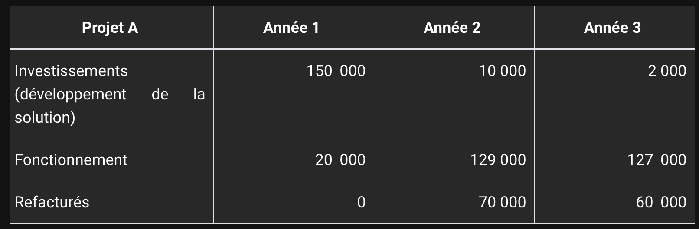

Les indicateurs lies au budget

Au cours d’un exercice, le chef de projet mesure d’abord le niveau d’engagement de son budget, c’est-à-dire le rapport entre les montants consommés et la dotation originale. Ceci l’aide à contrôler si les dépenses s’effectuent avec un rythme compatible aux prévisions, voire à détecter des dépassements de budget ou au contraire voir si des économies définitives ont pu être réalisées.

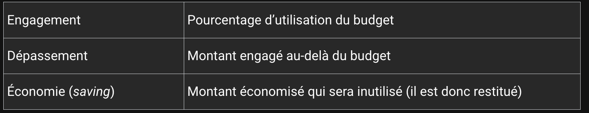

### Le modele economique

Le modèle économique est un choix marketing qui influence grandement la dynamique du chiffre d’affaires. Voici quelques exemples de business models liés aux solutions logicielles.

a. Licence et maintenance
C’est l’approche la plus répandue. Le client s’acquitte d’un droit initial d’usage (la licence utilisateur) et d’une maintenance périodique (annuelle par exemple) d’un montant généralement compris entre 15 % et 25 % du prix de la licence.

Les opérations d’installation et la formation sont le plus souvent facturées séparément de la licence et n’entrent pas dans le cadre de la maintenance. Cette dernière regroupe les mises à jour correctives et évolutives de la solution, ainsi que l’assistance aux utilisateurs (support).

Lorsque le client est dégagé de ses obligations de souscription à la maintenance, il poursuit l’exploitation de sa solution, même si celle-ci n’est plus mise à jour.

b. L’abonnement (SaaS)
Dans le modèle par abonnement, le client s’acquitte périodiquement d’un droit d’usage de la solution. Le non-paiement des redevances provoque la rupture du contrat et entraîne l’arrêt des services ; ce modèle est appelé Software as a Service (SaaS) car, pour le prestataire, la meilleure solution pour s’assurer que l’ex-client n’accède plus à la solution consiste à déporter les données et l’application hors des murs de ce dernier. Le modèle SaaS est donc bien adapté aux solutions Internet.

c. Le modèle transactionnel (Pay as you go)
Dans cette approche, le système est relativement ouvert et incite l’utilisateur à consommer des services ; ceux-ci sont comptabilisés en fonction de l’usage selon un modèle prépayé ou au contraire facturés a posteriori. L’unité de facturation, la transaction, a donné son nom au modèle transactionnel que l’on appelle aussi Pay as you go.

### La projection financiere (hors programme)

Un tableau projetant les coûts et les revenus sert de base à l’analyse financière. Celle-ci procède des flux de trésorerie entrants (revenus) et sortants (coûts). Les coûts dépendent de la structuration du projet et des modalités de son exploitation. Quant aux revenus, ils sont régis par le modèle économique (business model). Évidemment, chaque partie de la structure financière est également assujettie aux caractéristiques de l’autre. Le revenu ne peut démarrer que lorsque le projet est terminé et que le produit est disponible. Les modalités d’hébergement dépendent largement du modèle d’exploitation, lui-même fondé sur le modèle économique (SaaS…).

On represente en details les **flux de tresorerie** (cash flow), qui nous permettent d'aboutir à une analye financiere detaillee (hors programme aussi)

L’analyse financière prévoit les bénéfices (respectivement les pertes) du projet en fonction du rythme et de l’amplitude de ces mouvements. La trésorerie (cash-flow) résume les entrées et sorties d’argent au cours de la durée du projet. Il est courant d’avoir à fournir « un effort » plus important en début de projet, c’est-à-dire de produire du cash pour lancer et financer le projet. Au contraire, la trésorerie est souvent très positive sur la deuxième moitié du projet car les investissements en R&D (recherche et développement) sont limités et les ventes battent leur plein.

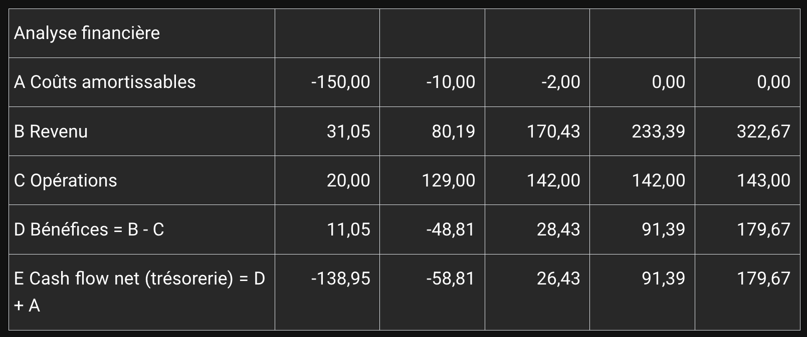

Afin de rendre lisibles ces mouvements de trésorerie en dent de scie et d’accompagner des efforts de R&D conséquents, on a introduit le système d’amortissement des coûts et de reconnaissance du revenu : les coûts de réalisation (R&D) sont progressivement réintroduits dans le calcul de la marge (profit). La reconnaissance du revenu correspond quant à elle à un lissage du chiffre d’affaires mais nous ne l’avons pas détaillé dans le tableau suivant :

### Le business case (hors programme)

### Le suivi financier des projets

#### Les comptes rendus d'activité
Les comptes rendus d’activité (CRA) sont des instruments de mesure indispensables pour contrôler la bonne exécution du planning comme du budget de réalisation du projet. Ainsi, le chef de projet doit être sensibilisé aux aspects financiers et, plus encore, s’inscrire dans une démarche de maîtrise des coûts, au même titre que la qualité et les délais.

### Aspect juridique

#### La reglementation concernant les donnees personnelles RGPD

La protection des données personnelles est devenue une priorité dans nombre de législations, accompagnant l’essor sans précédent du marché digital et de l’usage massif de données marketing. L’Union européenne applique depuis 2018 le règlement général de protection des données (RGPD ou GDPR en anglais), et beaucoup d’autres pays dans le monde ont adopté des législations similaires.

Cette démarche responsabilise les organisations collectant des données personnelles en encadrant précisément leur usage et leur confidentialité. Les principes de la protection des données sont les suivants :

Les données collectées sont la propriété des individus (data subject).
Les organismes de contrôle de données (data controller) doivent limiter la collecte de données personnelles aux besoins d’un traitement légitime librement consenti par l’individu, lequel a au préalable reçu une information complète sur l’objet des traitements.
Les organismes sous-traitants (data processor) exercent sous la responsabilité du contrôleur de données et doivent une transparence complète quant aux modalités d’accès et d’emploi des données (territorialité de l’hébergement, sécurité du stockage…).
L’individu dispose d’un droit de consultation, de rectification ou de suppression de l’ensemble de ses données personnelles.

Toute divulgation, altération ou vol de données personnelles doit être déclaré auprès des autorités compétentes, et les individus informés de cette situation.

Le contrôleur de données a la responsabilité du respect de ces principes. En cas de manquement, il s’expose à de fortes pénalités, voire à des poursuites judiciaires. En particulier, les systèmes de stockage et de traitement des données personnelles ont l’obligation d’être sécurisés par conception (privacy by design). Cela signifie qu’un contrôleur de données ne saurait opposer le caractère obsolète, non sécurisé ou non conforme d’un applicatif pour justifier le non-respect de la législation en protection des données personnelles.

Comme première conséquence, les applicatifs existants doivent être audités et mis à niveau, ce qui constitue souvent un projet à part entière.

Bien entendu, tout projet de développement, d’intégration ou de mise en œuvre de données personnelles doit comporter un volet destiné à satisfaire aux législations relatives à la protection des données personnelles sur l’ensemble des territoires concernés.

1. Que recouvre le terme de données personnelles ?
   Toute donnée permettant d’identifier directement ou indirectement est considérée comme personnelle (personal information attribute). Il s’agit du nom, d’une adresse postale ou d’un email, d’un numéro de téléphone, d’un numéro d’assuré, d’un numéro de contrat ou même d’une plaque minéralogique.
   Si la personne peut être identifiée en réalisant des recoupements dans une base de données, alors l’ensemble des attributs de recherche sont également considérés comme personnels.

Bien entendu, les autres attributs rattachés à un individu entrent aussi dans la catégorie des données personnelles - informations géographiques, attributs sociaux-démographiques, religions, orientation sexuelle, donnée médicale, financière, mandat social ou électif…

D’une manière générale, les législations en protection des données personnelles exigent que la collecte de telles informations soit limitée au strict nécessaire et que les bases de données soient sécurisées dans l’accès aux données, à leur stockage et leur manipulation.

2. Des données personnelles conservées le temps d’effectuer des traitements
   La collecte des données personnelles s’inscrit dans le cadre d’un traitement légitime, l’individu ayant formalisé son accord pour le recueil et le traitement. De ce fait, les données personnelles ne sauraient être conservées durablement à l’issue du traitement.

Dans le cas d’un devis, si la prestation n’est pas engagée par le client, son identité et ses coordonnées doivent être effacés au-delà d’une certaine période (fin de validité du devis par exemple). Si la prestation est facturée, les règles de conservation s’appliquent dans le cadre financier et comptable  ; les données personnelles ne doivent pas être réutilisées pour constituer une liste de contacts à des fins de démarchage commercial.

3. Le stockage des données personnelles et leur neutralisation
   S’il est envisagé un stockage durable des données personnelles, au-delà du traitement légitime, les données doivent être à la fois protégées et neutralisées. La protection des accès sert à se prémunir de l’altération frauduleuse ou accidentelle des données personnelles ou de leurs captations. Toute infraction ou tentative d’infraction, toute divulgation doit être déclarée auprès des autorités compétentes.

S’il n’est plus nécessaire de conserver les moyens d’identifier une personne, les attributs d’identification peuvent être effacés, anonymisés ou pseudonymisés. Ces opérations rendent impossible l’identification d’une personne à partir des attributs restants qui peuvent être utilisés de façon agrégée (donc non individuelle).

4. Le registre des traitements
   Le registre des traitements recense l’ensemble des traitements portant sur des données personnelles. Il existe dans toute organisation effectuant des traitements, que ce soit par le contrôleur de traitements (data controller) ou ses sous-traitants (data processor).

Les modalités de chaque traitement y sont détaillées :

Identification du traitement.

Objet du traitement.

Liste exhaustive des données mises en jeu.

Durée du traitement.

Recours à de la sous-traitance.

Territorialisation des données.

Modalités techniques de sécurisation des données.

Durée de conservation des données.

Modalités de sauvegarde.

Modalités de neutralisation des données (effacement, anonymisation…).

Le registre est actualisé à chaque modification de traitements. Il peut être demandé de le communiquer en cas d’audit.

5. La territorialisation des données dans le cadre d’un projet de développement
   Les réglementations en matière de protection des données personnelles s’appliquent sur un territoire défini. Cela a des conséquences sur l’hébergement des données dans les phases de développement comme de production.

Le plus grand soin doit être apporté pendant le développement pour protéger les données personnelles et éviter leur diffusion incontrôlée.

Par exemple, l’envoi de fichiers en clair par mail contrevient aux règles de sécurisation. Les fichiers doivent être cryptés par un mot de passe, et le mail pouvant être aisément retransféré, il convient de le supprimer après réception et traitement. Comme alternative, des solutions de messagerie sécurisée sont disponibles sur le marché.

Les développeurs doivent aussi éviter de laisser des fichiers, bases de données, listings accessibles sans moyens de sécurisation adaptés. Et ces données personnelles ne peuvent être transférées en dehors du territoire sans appliquer les mêmes règles de protection des données.

Pour ce qui relève de la production, les bases de données sont majoritairement situées sur des infrastructures Cloud, c’est-à-dire à la fois géorépliquées et fonctionnant sur des machines opérées en dehors des organisations qui contrôlent les données. On pourrait avoir le cas d’une entreprise située en France, ayant pour projet de confier ses bases de données personnelles à un acteur du Cloud ne proposant des hébergements qu’en dehors de l’UE, en Angleterre ou aux USA. Ce type d’hébergement extraterritorial ajoute des contraintes supplémentaires pour que le RGPD s’applique, il serait sans aucun doute plus simple de choisir un hébergement physiquement localisé en UE et limité à ce territoire. 6. La responsabilité des données au sein des organisations (alias le CDO)
La diffusion des réglementations en matière de protection des données personnelles a fait émerger un nouveau rôle dans les organisations, le Chief Digital Officer (CDO). Il s’agit d’un rôle particulièrement important car la responsabilité pénale des dirigeants peut être engagée en cas de défaillance dans ce domaine.
Le CDO assure le pilotage de l’ensemble des activités liées à l’utilisation et à la protection des données personnelles. C’est généralement la personne à prévenir en cas de perte, de divulgation ou d’altération des données (data breach), afin de coordonner le plan d’action (déclaration auprès des autorités compétentes, sécurisation des données, analyse d’impact…).

C’est aussi le CDO qui veille à la bonne information des membres de l’organisation en matière de protection des données, définissant des programmes de formation et des procédures à appliquer au quotidien.

Le Chief Digital Officer est naturellement devenu un interlocuteur clé dans la conduite de projets informatiques.

## Les bases de l'agilité

Longtemps, le développement de programmes informatiques a été régi par des approches relativement cadrées, pour ne pas dire rigides. Non que ces approches soient mauvaises ou contre-performantes, mais le succès d’un développement selon le processus cascade (ou ses dérivés) dépend d’abord de la stabilité de ses spécifications.

Les temps ont changé, la technologie confère une productivité toujours accrue et l’accélération des mises sur le marché d’innombrables solutions informatiques bouleverse en permanence l’horizon des possibles, les stratégies et les besoins. Ce resserrement du temps est loin de constituer une contrainte, il peut devenir une opportunité pour celui qui ajuste sa démarche à la découverte progressive du besoin, remettant cent fois l’ouvrage sur le métier jusqu’à l’obtention d’un résultat satisfaisant.

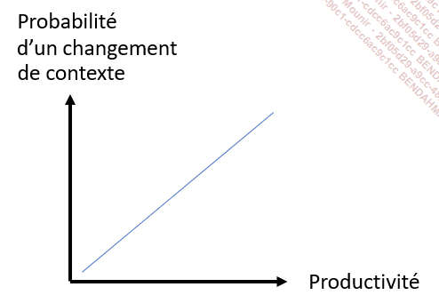

1. La maîtrise du risque
   Les projets informatiques ont parfois mauvaise réputation : longs, inachevés, peu documentés. Mais on concède aux équipes d’être confrontées à des difficultés assez communes.

Le contexte changeant est fréquemment mis en avant, l’expression de besoins n’est pas stable, ou alors la plateforme technique pas éprouvée. On regrette par ailleurs l’effet tunnel ; tandis qu’une poignée de développeurs s’escrime à produire une version démontrable, le client tenu à l’écart ne se doute pas du drame qui se joue en coulisses. Quand la démonstration survient, l’écart entre le rêve et la réalité se révèle si grand que la stratégie est remise en cause. Il faut repartir de zéro. Les erreurs d’estimation sont aussi souvent citées comme sources d’échec. Mais comment donner un chiffre précis quand on ne dispose pas d’un cahier des charges détaillé ? Laissons les développeurs mener le projet à son terme et on saura dire combien il aura coûté.
L’absence de prise en compte du risque constitue le point commun à ces assertions. Les équipes ne sont pas en cause, les méthodes classiques ne prévoient pas de s’adapter à un contexte évolutif.

2. Les methodes classiques et leur limites

On conçoit les approches classiques comme des processus de développement de type cascade (waterfall) ou ses dérivés tels que le cycle en V. Encore une fois, ces méthodes ont fait leurs preuves et elles sont à juste titre toujours employées, avec réussite, dans de nombreux projets.
Le processus classique prévoit un enchaînement linéaire d’activités, du cahier des charges jusqu’à la livraison de la solution informatique qui l’implémente. On comprend alors que la qualité du livrable et la qualité du projet vont de pair, et que celles-ci sont fonction de la précision du cahier des charges. Comme chaque étape n’est exécutée qu’une fois (une seule spécification, une seule phase de codage, un seul cycle de tests...), il est assez aisé d’organiser les activités dans le temps, en les projetant sur un plan de charge qui associe estimation des charges et ressources humaines comme matérielles.

Ces approches donnent un résultat correct dès lors que le besoin est stable et que l’implémentation n’est soumise à aucun aléa informatique. La découverte d’un bug au cours du cycle de tests peut s’avérer catastrophique s’il est avéré que la conception est en cause. Il faut alors remonter le temps et tout reprendre depuis le point de défaillance. Par chance, certains projets ne sont pas exposés à ces aléas ; les exemples d’application de gestion écrite en technologie gros systèmes nous viennent à l’esprit.

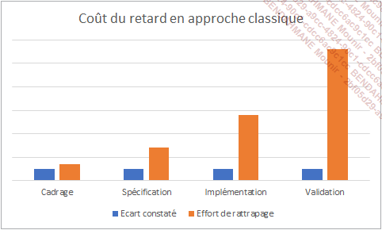

Mais la technologie a évolué, les nouveaux langages de développement sont moins formels tandis qu’ils laissent plus de possibilités aux programmeurs, la rapidité de compilation incite davantage à l’essai itératif (code and fix) plutôt qu’à une conception rigoureuse. De plus, les besoins sont moins précis, car leurs auteurs ne veulent pas les graver dans le marbre, se laissant ainsi l’opportunité de voir plus large, de différer un choix qui ne saurait être définitif.

Ces conditions désormais assez répandues perturberont fortement l’exécution d’un projet selon une approche classique, le chef de projet utilisant son énergie à resynchroniser toutes ses ressources, le comité de pilotage constatant l’explosion des charges.

Quand on pense à la notion de risque, c’est souvent pour exprimer la crainte d’une déviation du planning. Dans un premier temps, on redoute les conséquences d’un aléa, la complétude du livrable, la qualité de celui-ci et, bien entendu, la tenue de l’échéance impérative de livraison. L’approche classique se concentre sur le respect holistique des composants QCD (Qualité, Coût, Délai) et n’envisage aucune matrice d’arbitrage. En cas d’écart, le chef de projet détermine le chemin critique et recommande l’ajout de ressources, parfois de paralléliser certaines activités en vue d’obtenir in fine le livrable complet, intègre et à la bonne date.

Cette méthode n’est pas satisfaisante, car elle peut engendrer de nombreux surcoûts pour un résultat discutable. Plus on est près de l’échéance, pire est l’effort requis pour combler le retard. Cet effort devient insoutenable pour le comité de pilotage, et les tentations sont grandes en dernier ressort de procéder à des coupes sombres, non anticipées, non assumées, dans la complétude ou la fiabilité du livrable. Il n’y a pas de matrice d’arbitrage, mais la date est souvent la seule dimension parfaitement comprise et partagée. Il est beaucoup plus aisé d’atténuer la perception d’un périmètre incomplet et de s’appuyer sur une rhétorique selon laquelle les bugs sont indissociables d’une livraison. Pour résumer, l’informatique n’est pas toujours aussi fiable qu’on le souhaiterait.

Dans le cas d’espèce, l’exécution de tels projets s’avère être un gâchis de moyens, les équipes se voient décrédibilisées et se démotivent. Cette issue approximative est-elle inéluctable ?

Les méthodes agiles opèrent en amont de la zone délicate, sous un angle d’attaque imparable : puisque le respect QCD est incertain, autant s’en passer.

Tout est affaire de nuance et de discernement pour rendre ces méthodes efficaces et crédibles, mais admettons que tout soit relatif, ajustable, non indispensable, tant que le client serait satisfait. Pour accepter cette idée peut-être incongrue, comparons les approches classiques avec celles dites agiles :

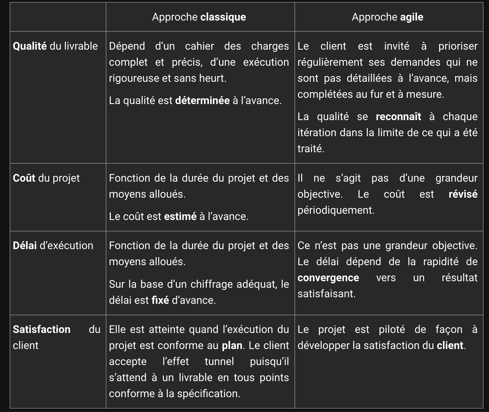

### Les preceptes agiles

Passons maintenant au sens littéral du terme. Quelles sont les règles d’or à honorer pour mener un projet de façon agile ?

a. Stratégie des petits pas
Au début de l’informatique, la gestion de projet suivait surtout la méthode d’analyse. On peut résumer et généraliser (sans doute un peu exagérément) le principe central de ces méthodes : diviser pour régner, simplifier progressivement un problème jusqu’à le décomposer en une suite d’instructions élémentaires faciles à décrire, à planifier, à implémenter et à tester. Cette approche n’est pas remise en cause, elle s’applique encore, même dans le cadre de projets agiles.

Considérons à présent un projet d’une certaine complexité. Son plan peut s’envisager comme la somme de problèmes réductibles à de simples programmes. Mais il peut survenir une autre difficulté pas seulement liée à la complexité intrinsèque d’un des problèmes qui composent le projet, mais due au séquencement des résultats à produire dans un certain ordre qui satisfasse les dépendances entre modules.

Si le projet comporte des risques ou des incertitudes comme la complétude du cahier des charges, l’exécution prédéterminée du plan d’ensemble serait compromise par un problème insurmontable, au coût inacceptable. Ne vaudrait-il pas mieux procéder par étapes et réévaluer périodiquement l’opportunité de poursuivre le projet ?

Les méthodes agiles partagent cette caractéristique de ne pas diviser d’emblée le problème en une suite prédéterminée de sous-problèmes, mais d’organiser le projet selon des phases de durée stable (deux semaines, trois mois...) et de contrôler l’évolution du résultat sous le prisme de la satisfaction client.

b. Fail fast et quick win
Revenons à la question de la productivité des méthodes classiques. Chaque surcapacité est une perte, et chaque sous-capacité une difficulté vite insurmontable. Or, la fiabilité de l’estimation est souvent variable d’une tâche à l’autre, et même parfois très faible quand le cahier des charges n’a pas été complété à temps.

Être agile, c’est procéder à des essais ; se tromper vite est un moyen de réaliser des économies. Une voie technique à explorer, l’intérêt d’une fonctionnalité à valider, apprenons vite de nos erreurs.

La tentative « de quelque chose » d’incongru, d’osé, est récompensée par l’atteinte rapide d’un résultat démontrable.

Fail fast, quick win, l’échec est permis, le pari est encouragé.

c. Implication du client
De nos jours, évidente, la présence du client au cœur du développement n’est pas toujours allée de soi.

On peut partager les réticences de tout un chacun à s’embarrasser d’un encombrant représentant du métier, qui est en position de critiquer un résultat encore en phase d’élaboration, sans être un spécialiste de l’informatique. Le contrat est pourtant clair et le plan projet net comme le fil du rasoir. Inutile dès lors de redouter l’effet tunnel, le client tient la place qui lui est dévolue par la méthode cascade ou par le cycle en V.
Oui, mais un projet se déroule rarement sans aléas. Opposons maintenant deux stratégies : élaborer une explication convaincante, gérer l’écart, assumer le choix d’une voie médiane, ou bien profiter de l’avis éclairé du client qui n’analyse pas l’anomalie sous un angle informatique, précisément parce qu’il n’est pas développeur. Le client suit l’adéquation du résultat à ses critères économiques (pour ne pas dire business).

Le client est sans doute le mieux placé pour apprécier l’évolution du produit. L’intégrer dans l’équipe projet, c’est le responsabiliser vis-à-vis de ses choix, et diminuer par là même la pression liée à la gestion des écarts.

3. Les nouveaux rôles
   Par opposition aux méthodes classiques, les méthodes agiles partagent une autre définition de l’organisation. La séquence d’activité suivant une logique prédéterminée est remplacée par l’évaluation périodique de l’amélioration de la satisfaction client.

Certes, ces nouvelles modalités remettent en cause la prédominance de certains rôles dans la conduite réussie d’un projet, mais elles n’amoindrissent aucunement le caractère structuré et logique des projets agiles. Voyons comment se répartissent les responsabilités.

a. Product manager et product owner
Le product manager ou PM est une appellation anglaise désormais standard. Il a pour principale mission d’orienter l’évolution du produit de façon à maximiser sa valeur business aux yeux du client. Plus haute est cette valeur, meilleure est la satisfaction. Le terme product owner ou PO désigne la même mission dans le cas de la méthode Scrum (voir section La méthodologie Scrum).

Le PM est le premier créatif de l’équipe agile, il insuffle au projet son inspiration, à la recherche d’opportunités qu’il doit évaluer, en déterminant ce qui est à réaliser par l’équipe de développement.

La connaissance du client et de son domaine métier est la première compétence du PM. Comme l’agilité est l’art de combiner les expertises et de surfer en dehors de son domaine de prédilection, le product manager contribue aussi aux discussions technico-fonctionnelles qui pourraient impacter la satisfaction client, concerner de nouvelles opportunités telles que les données associées au produit ou son contexte économique, son industrie... La qualité du travail du PM dépend aussi d’une revue par des clients référents.

Le projet performant est celui d’un PM qui ne cherche pas à livrer des fonctionnalités, mais dans lequel il suscite la collaboration interfonctionnelle, pour fournir de la valeur métier.

Le product manager est l’interlocuteur privilégié du client, dont il comprend les enjeux métier, avec lequel il travaille de façon régulière ; c’est son partenaire pour dépasser et résoudre des problématiques business.

b. De chef de projet à Scrum master
Nous n’avons pas encore traité la question de la dissolubilité des méthodes agiles dans des formats plus classiques. À l’échelle de l’entreprise, le chef de projet a deux casquettes. D’une part, il a la charge de l’exécution d’un plan projet, mettant en œuvre des ressources humaines et informatiques pour accomplir sa réalisation. D’autre part, il rend compte de l’avancement de son projet au comité de pilotage, au sein duquel il participe à des décisions d’arbitrage.

Étant donné que le planning d’ensemble n’est pas un préalable à la méthode agile, la première de ces missions pourrait être remise en question. C’est le pas qu’a franchi la méthode Scrum en abolissant le terme chef de projet.

Le Scrum master n’est d’ailleurs pas une affectation nécessairement fixe au cours du projet, elle peut tourner et se voir confiée à n’importe quel membre de l’équipe. Nous détaillerons un peu plus tard les missions du Scrum master, bien entendu dans le cadre de la méthode Scrum.

c. D’architecte à product designer
À la recherche d’un résultat démontrable rapidement, la conception (ou design en anglais) d’un produit emprunte des circuits courts et spécialisés. L’expertise technique est apportée là où l’incertitude constitue un risque d’impact sur la satisfaction.

Auparavant, on travaillait à l’élaboration d’interfaces graphiques selon des standards de l’industrie (des normes), des règles issues du client et des capacités de la technologie maîtrisée par les développeurs. Désormais, on s’attache à fournir une expérience utilisateur (UX pour User Experience) d’un niveau susceptible de satisfaire le client et son marché. En appliquant ce même principe en backoffice, il est particulièrement coûteux de mettre en œuvre intégralement un système qui sera écarté du projet après quelques tests.
Dans un projet agile qui fonctionne bien, le product designer intervient en permanence. Il n’y a pas de phase de design initial puis d’implémentation, mais une suite de prototypes évalués à l’aune de la satisfaction, améliorés et épurés. Les product designers appliquent d’ailleurs le principe KISS (Keep It Simple, Stupid et toutes ses variantes), en maintenant en parallèle l’efficacité du résultat et la simplicité du design.

d. Delivery manager ou program manager
Dans un projet au format classique, l’effort nécessaire à la fabrication des releases de production représente 30 à 40 % du budget. Rapportée sur une échelle de temps, l’industrialisation des développements constitue une phase longue et souvent irréductible au cours de laquelle les non-experts assistent incrédules aux difficultés de stabiliser une solution qui n’a pas encore été confrontée à ses conditions réelles d’exploitation.

Cette approche ne rentre pas dans des cycles logiciels courts. La démontrabilité d’une solution en gestation est le point clé, et le dialogue avec le client déterminant.

Comme conséquence, toutes les tâches de fabrication sont automatisées et il n’existe qu’un seul circuit pour exploiter le produit, qu’on soit développeur, testeur, product manager ou client.

Le delivery manager supprime les empêchements techniques et organisationnels, supervise l’exécution du processus, et coordonne les équipes. Cette mission est possiblement assurée par le Scrum master ou par une personne en charge des opérations de déploiement continu des développements (DevOps).

Le succès d’un projet agile repose sur les actions déterminantes de son delivery manager, qui résout les problèmes techniques ou organisationnels, élimine les difficultés, agit comme un coach du processus et non comme un exécutant, et qui vit pour livrer !

## Quelques approches agiles remarquables

### **Scrum**

La méthode Scrum, élaborée à partir de 1986, s’est répandue et imposée depuis quelques années comme étant la référence dans la mise en œuvre de projets agiles. Il s’agit d’une approche holistique qui procède par cycles courts (des sprints ou itérations) pour organiser le développement logiciel de façon incrémentale et itérative. Les fonctionnalités sont réalisées progressivement et **livrées au fur et à mesure**.
La terminologie Scrum est quasiment passée dans le langage courant, elle est appliquée par extension à d’autres méthodes agiles.

**a. La définition du backlog**
Le backlog représente l’ensemble des entrants fonctionnels comme techniques à réaliser. Il s’agit d’un stock continuellement mis à jour, chaque sprint étant l’occasion de puiser des éléments à implémenter ou d’en ajouter d’autres.

L’élément de travail de base est l’histoire utilisateur et son pendant l’histoire technique, respectivement désignées user story (US) et technical story (TS). Une US décrit la fonctionnalité telle qu’appréhendée par l’utilisateur. Il n’est pas nécessaire de faire figurer dans l’US des instructions techniques relatives à l’implémentation, bien que cela soit une possibilité. L’élément de travail comporte un titre, une référence unique déterminée par le système de gestion (Jira, VSTS...), une description fonctionnelle, mais aussi des critères d’achèvement ou definition of done.
De façon à cartographier le système logiciel en devenir et à structurer les US dans un ensemble d’éléments de travail parfois vaste, les systèmes de gestion introduisent des surensembles d’US tels que les epics et les features.
Le backlog comprend aussi des bugs remontés lors des cycles de tests ou par les utilisateurs.

Le travail de rédaction des US emprunte lui-même un processus itératif et incrémental. Il est habituel de lister les US dans le backlog, puis de les compléter au fil des sprints.

Bien que, par essence, Scrum ne fixe aucune règle quant à la structuration des sprints (autrement dit, l’ordre et la quantité d’US à traiter ne sont pas déterminés par la méthode), de nouvelles approches visent à organiser le découpage du projet pour atteindre plus rapidement et plus facilement la satisfaction client. La cartographie des histoires utilisateurs (ou story mapping) représente en deux dimensions les US, par séquence de fonctionnalités utilisateurs et par ordre d’importance métier. Cette approche aide l’équipe projet à se préoccuper en priorité de ce qui est important et impactant pour la satisfaction du client.

**b. Les sprints ou itérations**

Les sprints structurent les projets Scrum. Ce sont des cycles d’activités généralement assez courts - deux semaines - où se succèdent des réunions appelées cérémonies et des phases de production logicielle.

Il existe sans doute autant de façons d’appliquer Scrum que d’équipes et de projets, et autant de possibilités de personnaliser les cérémonies, d’en introduire de nouvelles ou d’en écarter certaines. Cela dit, quatre d’entre elles restent des incontournables de la méthode Scrum.

En début de sprint, au cours de la séance d’entretien du backlog (grooming) et de conception du sprint (sprint planning meeting) sont sélectionnées les US à engager dans le cycle courant.

En début de chaque journée a lieu la réunion quotidienne (daily standup meeting ou DSM) au cours de laquelle chaque membre de l’équipe énonce son avancement, ses difficultés et son programme pour la journée. Le Scrum master est le secrétaire de séance, il guide ses équipiers dans les courts débats qui s’engagent.

La revue d’itération (sprint review) est une démonstration par l’équipe et au client des livrables réalisés pendant le sprint. C’est donc une réunion fondamentale puisque le client avec le product owner formulent le degré de satisfaction vis-à-vis du produit tout juste retravaillé, et donnent des orientations pour le sprint qui succédera.

La rétrospective (sprint retro), qui peut avoir lieu en même temps que la revue, met l’accent sur ce qui a fonctionné et sur ce qui pourrait être amélioré, dans un registre technique, organisationnel, communication... La rétrospective est une caractéristique qui illustre la philosophie holistique du Scrum standard, en cherchant l’amélioration continue dans le cadre du projet lui-même.

**c. L’avancement dans Scrum**

Revenons un instant sur l’organisation des flux de travail dans un projet agile ; le planning de type Gantt ne s’emploie pas, car les tâches ne sont pas estimées en j.h, mais en points de complexité.

L’équipe a déterminé en début de sprint combien de points de complexité pouvaient être engagés conformément à sa vélocité. Le suivi des tâches s’effectue à l’aide d’un tableau divisé en colonnes (À faire, En cours, À valider, Terminé...). Des étiquettes représentant les tâches (des US ou des bugs) sont déplacées d’une colonne à l’autre au fur et à mesure des traitements.

Bien que les systèmes de gestion tels que Jira ou VSTS proposent des tableaux de bord assez efficaces, il n’est pas rare que l’équipe installe aussi un véritable tableau sur lequel sont apposées des étiquettes collantes.
Afin de quantifier l’effort restant pour compléter les US du sprint, on utilise un burndown chart. Ce graphique représente en abscisse le temps (en jours, en semaines...) et en ordonnée l’effort restant. La courbe est souvent comparée à une droite qui part du point (0, Total engagé) et qui descend jusqu’au point (Fin de sprint, 0).

**d. Le rôle du Scrum master**

La méthode Scrum ne prévoit pas de hiérarchie entre les rôles. Elle constitue un tout et son application rigoureuse est la condition sine qua non de réussite du projet.

Le Scrum master a la charge de l’application à bon escient de la méthode. Il a pour mission d’aider l’équipe à dérouler le projet, à s’entraider, à s’améliorer et à dépasser les difficultés d’organisation. Le Scrum master n’est donc pas un chef de projet ni un leader dirigiste, mais un facilitateur qui guide et coache son équipe. Cette définition du rôle du Scrum master, déterminé par la méthode elle-même, est une nouvelle illustration de son concept tout-en-un, et d’un accent davantage mis sur la performance de l’équipe que sur la prédictibilité du projet.
Ce lemme produit deux corollaires. D’abord, la fonction de Scrum master n’est pas réservée à une personne, elle peut être attribuée successivement à n’importe quel membre de l’équipe. Ensuite, les Scrum masters d’une organisation peuvent se réunir dans des réunions de Scrum à Scrum (Scrum to Scrum) appelées méta-Scrum, destinées à solutionner les problèmes de coordination entre équipes Scrum.

### **Kanban**

Les organisateurs de la productivité de Toyota (dont les célèbres Taiichi Ohno et Shigeo Shingo) ont élaboré patiemment le lean manufacturing et la méthode Kanban dans les années 1950. Jusque-là très proches du modèle tayloriste des usines américaines, leurs méthodes de production se sont démarquées par leurs performances supérieures et se sont ensuite généralisées à l’ensemble de l’industrie, bien au-delà du secteur de la construction automobile.

Une usine développe des processus de production complexes où les centres de coût et de défaut sont multiples. Le stockage des matières premières comme des produits en cours de fabrication est une première difficulté, le transport entre les chaînes d’assemblage en est une autre, sans compter les temps d’attente à provisionner une étape de la chaîne de valeur en éléments exempts de défauts.

Or, la production doit répondre à une demande de livraison qui ne peut être complètement contrôlée. Les ingénieurs du TPS (Toyota Productivity System) ont alors modifié l’organisation à base de flux poussé en flux tiré.

Dans l’approche historique, le stock de matières premières est assemblé en éléments déplacés à chaque étape de la construction jusqu’à devenir un autre stock de produits finis en attente d’être vendus. Ce stock coûte cher (entreposage, transport...), alors que sa valorisation peut être dépréciée selon les conditions économiques. Cette organisation pose également un autre problème. La surabondance du stock à chaque étage de la chaîne de valeur perturbe le traitement des défauts : pas le temps de rectifier un article, tout le stock intermédiaire doit être traité puis expédié à l’étape suivante.

Le parallèle avec un projet informatique est assez évident ; les goulets d’étranglement se créent de façon systémique. Même avec une méthode comme Scrum, il n’est pas prévu d’aligner la capacité des testeurs sur celle des développeurs et il faut plusieurs sprints de rodage pour déterminer la vélocité moyenne de l’équipe. Ce qui n’empêche pas une contre-performance lors d’un sprint si de nombreux bugs apparaissent au cours du codage, révélés lors des tests, corrigés ou non dans le cadre du sprint en cours.

Dans l’organisation à flux tiré, les équipes déterminent et ajustent la capacité de chaque étage de la chaîne de valeur, le processus est conçu en partant de la fin. Ce changement est radical, les goulets d’étranglement systémiques sont évités, le stock intermédiaire ramené à son strict minimum, le temps d’exécution prévoit ce qu’il faut pour retraiter des éléments défectueux.

Pour satisfaire la demande fluctuante des clients sans malmener les équipes de production, les concepteurs de la méthode ont intégré l’application permanente de petits changements. Cette approche a fait la preuve d’une meilleure efficacité que de grandes révolutions ou le recours à des méthodes rigides.

a. Une cartographie visuelle suivie par tous
Le terme « Kanban » signifie « carte visuelle » ; le procédé repose sur la connaissance par toute l’équipe de l’état du projet et des capacités de traitement. Les tableaux de bord de Scrum et de Kanban sont assez similaires, présentant en colonnes les différentes étapes de construction (À faire, En cours, À valider, Terminé).

Sur le tableau de bord de Kanban, des chiffres indiquent les capacités de chaque processus :

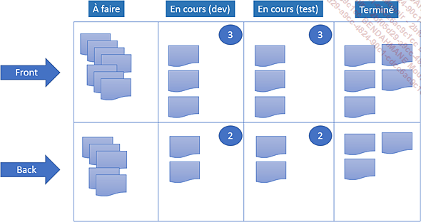

**b. Flux continu**
L’élimination des stocks et la production juste à temps sont l’essence même du lean management. Appliquées aux projets informatiques, les fonctionnalités sont publiées dès qu’elles sont réalisées, les releases étant cadencées selon les critères de l’équipe et en fonction des besoins client.

Plus encore qu’avec Scrum, le recours à des systèmes d’intégration continue, de tests automatiques et de publication rapide est primordial dans la mise en œuvre de projets agiles au format Kanban.

**c. Pas de rôles**
En tant que système d’organisation et de planification, Kanban ne définit pas de rôles. L’équipe régule le flux de traitement des tâches selon ses propres capacités et peut faire appel à un coach agile pour la guider.

Cependant, les principaux rôles d’un projet agile trouvent naturellement leur place dans le dispositif : product management, delivery management, design management, et bien entendu développement ou testing.

**d. Lead time plutôt que vélocité**
Chaque format de projet possède une métrique qui le caractérise : le respect QCD pour le modèle en cascade, la vélocité pour le Scrum, et pour Kanban, qui se trouve à l’opposé des méthodes classiques, le lead time.

Le lead time exprime le temps entre la commande et la livraison, délai que l’on souhaite le plus court possible pour éviter le risque d’un changement, voire d’une annulation. Cette métrique est à rapprocher du takt time qui exprime la pression des attentes client (rythme de livraison attendu).
Dans le cas de Scrum, la vélocité est une mesure de la performance de l’équipe. Elle est donc plutôt similaire au temps de cycle, qui traduit le délai entre la première et la dernière opération pour réaliser un produit fini. Le temps de cycle comme la vélocité dépendent de la capacité de l’équipe à livrer dans un contexte donné, alors que le lead time est résolument destiné à maximiser la satisfaction du client.

**e. Des changements à tout moment**
Dans un projet réalisé avec un niveau de charge assez élevé, les équipes ont un réflexe répandu qui consiste à avancer au maximum la production intermédiaire, en menant toutes les activités en parallèle. Ce qui est fait n’est plus à faire, entend-on souvent.

En fait, loin d’être efficace, cette approche paralyse le système de production, qui n’admet plus aucun changement de priorité et qui ne trouve jamais la ressource nécessaire pour se réformer.

À commencer par les exigences client dont le flux ne peut être totalement contrôlé, les changements de priorité surviennent constamment. Là encore, Kanban se distingue de Scrum par sa dynamique de production tournée vers le client (le flux tiré) et sa production juste à temps (just in time ou JIT). L’écart entre la capacité de production nominale et la demande client constitue un gisement de temps inépuisable pour s’améliorer ou ajuster la production à la demande instantanée.

## **1 Les outils agiles**

### Un systeme integre de gestion de projet:

- Jira
- Azure DevOps
- Trello

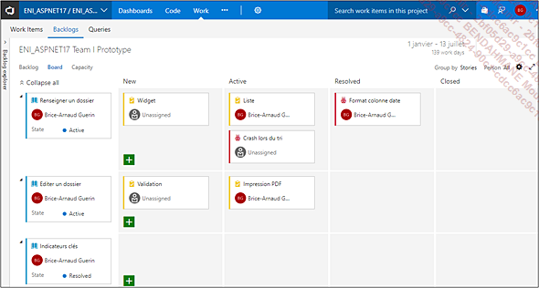

### Un outil de planification

Même si les coûts ont considérablement baissé (Azure DevOps est accessible gratuitement en version Community), l’adoption d’un système intégré n’est pas un prérequis. Les équipes se contentent parfois d’un backlog maintenu à l’aide d’un tableur et d’un outil de planification ad hoc.

La plateforme en ligne Smartsheet propose un tableau de bord pour projets agiles à personnaliser de façon très simple.

### **2. Testing**
Les méthodes agiles concrétisent tout leur potentiel lorsque les anomalies (écarts, bugs) sont à la fois identifiées et corrigées rapidement. Pour cette raison, les technologies employées mettent largement l’accent sur l’activité de tests.

Les tests unitaires sont quasiment toujours automatisés, déclenchés lorsque le développeur tente d’archiver son code sur une branche de développement. En cas d’échec du test, l’archivage du code est normalement refusé. Ce mode de fonctionnement constitue une pratique saine et évite les allers-retours entre les équipes de test et celles de développement, minimisant par là même les tensions liées à la validité des tests unitaires.
Dans le monde Java, les frameworks de tests unitaires Swagger, Cucumber, Mockito ou Gerrit (revue de code) sont fréquemment utilisés. Ces frameworks sont parfois portés dans d’autres environnements (PHP, .NET...), même s’ils ne sont alors pas toujours aussi performants que des outils natifs. Microsoft propose aussi un système de tests automatisés très complet, tant destiné aux parties basses des architectures (des services web) que hautes (des interfaces graphiques).

Pour des tests d’intégration et des scénarios plus complexes faisant intervenir des interfaces graphiques, il existe des solutions open source telles que Selenium ou Robot Framework, mais aussi des suites logicielles commerciales très puissantes comme Test Complete, Mercury, Test Director...
Au-delà de l’outillage, l’activité de test dans un projet agile est primordiale. La conception des scénarios de test, des jeux d’essai, résulte souvent d’une contribution multiple. Le product owner, le client, les membres de l’équipe QA (Quality Assurance), le delivery management mettent en commun leur connaissance du produit et du métier pour élaborer les cas de test.

Mais le travail de préparation ne s’arrête pas là. La réalisation d’un test automatisé nécessite aussi des connaissances techniques proches du développement, même avec un logiciel de haut niveau. Dans ce cas, le corpus des cas de test (test cases) constitue un véritable actif applicatif qu’il faut entretenir au fil des sprints et des projets.

### **3. Intégration continue**
Il n’y a pas que les tests qui soient automatisés. Les projets agiles mettent en œuvre des architectures complexes réalisées à partir de plusieurs technologies. Toute la chaîne de compilation (build, release) requiert plusieurs étapes avec des fichiers de configuration spécifiques à chaque environnement : développement, intégration, recette, préproduction, tests de charge, production...

Les architectures Java sont souvent desservies par Jenkins, orchestrateur capable de déclencher des builds Ant ou Maven (technologies de production de version logicielle), de déployer, de lancer des tests unitaires et de contrôler le flux d’exécution en fonction des codes de retour de chaque étape. D’autres plateformes font également leur apparition, les écosystèmes se faisant toujours plus complets selon la logique de la tache d’huile qui recouvre tout l’espace disponible.

Microsoft intègre aussi une version répartie de MS-Build capable de compiler en local ou en ligne, et même de déployer sur Azure.

## Planification Chiffrage et Estimation des projets agiles au quotidien

### L'estimation des charges

L’estimation des charges est souvent source de malentendu ; celui à qui on demande d’évaluer la quantité de temps à passer sur une tâche ne saisit pas toujours comment se rendre compte de cette durée sans au préalable l’effectuer ! Avec l’expérience, les réponses viennent plus facilement pour l’évaluation des nouvelles fonctionnalités. On assiste alors à d’autres blocages sur l’évaluation des bugs, lesquels ne sont pas encore identifiés !

Le chef de projet doit donc en premier lieu convaincre son équipe de la nécessité de formuler un avis, lequel ne sera pas définitif. Les chiffres seront réévalués tout au long du projet, c’est une activité intrinsèque à la conduite de projet.

Projet :
Un projet est un engagement de moyens pour atteindre un objectif. Un objectif non chiffré ne fait donc pas partie du projet. Toutes les tâches non évaluées ne peuvent donc pas être traitées, y compris les bugs.

#### **1. Les charges et les délais**
La première chose à établir clairement est la différence entre charge (effort en anglais) et délai (lead time ou elapse). Une charge, exprimée en jour par homme (j.h ou man.day en anglais), représente la quantité de travail fournie par une personne pour réaliser une tâche.

Le délai, c’est le nombre de jours maximum qui peut s’écouler entre le début de la réalisation d’une tâche et sa fin, en comptant sur la possibilité d’y engager plusieurs ressources (ou en tenant compte de contraintes d’exécutions qui pourraient au contraire rallonger cette durée).

Ainsi, une tâche de dix j.h peut demander un délai de dix jours si une seule personne y travaille, cinq jours si elle peut être divisée en deux sous-tâches exécutées en parallèle, et ainsi de suite. Parfois des contraintes d’organisation s’intercalent au milieu de la réalisation d’une tâche et augmentent de ce fait le délai. Nous reviendrons un peu plus tard sur les notions de reste à faire, de consommé et d’avancement. Pour le moment, nous nous concentrons sur l’estimation.

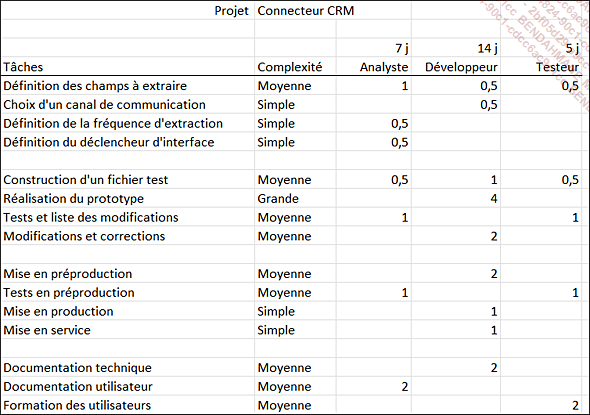

Le modèle de développement choisi influence nettement la liste des unités d’œuvre qui figurent dans l’organigramme, de même le nombre d’itérations pour les méthodes agiles.

L’estimation par tableau est largement plébiscitée par les ESN qui la déclinent en introduisant de nombreux facteurs :

- Architectures techniques standards.

- Services standards.

- Nombre d’éléments remarquables (nombre d’entités SQL, nombre d’écrans).

- Niveau de réutilisation d’une solution existante.

- Options fonctionnelles.

- Options techniques.

- Contraintes d’organisation (taille de l’équipe, jalons, planning, niveau de parallélisme entre les tâches, risques...).

L’ensemble de ces paramètres est introduit dans des logiciels chargés de produire la ou les estimations. Avec l’expérience, le chef de projet peut se créer des feuilles de calcul lui permettant de chiffrer rapidement ses projets, au moins pour une première approche.

### L'organisation du planning du chef de projet

Le chef de projet a comme responsabilité le suivi des opérations. En dehors de toute problématique liée à la tenue du planning, le suivi concerne d’abord l’aboutissement des tâches dans les conditions fixées par le cahier des charges.

Pour arriver à ce résultat, le chef de projet ne peut se contenter de créer des conditions favorables. Il doit expliquer ce qu’il attend des membres de son équipe, fixer des objectifs de réalisation et contrôler le résultat.

Ce processus appelé encadrement est détaillé ci-dessous :

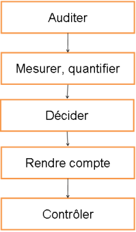

Les objectifs sont assignés de façon périodique ou permanente ; s’il s’agit de tâches liées à l’exécution d’un planning, le chef de projet indique au fur et à mesure le moment où il convient de les démarrer. La description des tâches (travail à effectuer, critères d’achèvement, livrables) est par ailleurs définie dans le document de spécifications détaillées du projet. S’il s’agit de tâches exceptionnelles (les imprévus), le chef de projet doit prendre soin de les présenter et de veiller à la capacité d’exécution dans les délais impartis.

L’audit consiste à récupérer des informations auprès des membres du projet. Il peut s’agir d’extraits de code, de fichiers binaires, de documentations, de notes de conception, de tableaux de suivi, de résultats de tests... Le recueil a lieu de façon périodique ou inopinée.

Ces informations sont ensuite analysées, mesurées (donc confrontées à des grandeurs de référence) et quantifiées ; la quantification indique si l’information donne lieu à une alerte ou non, par exemple lorsque la valeur mesurée dépasse un certain seuil.

Les alertes sont alors prises en compte par le chef de projet qui peut demander aux membres de l’équipe des précisions. Une décision s’impose pour faire revenir la situation à la normale.

Cette décision doit être portée à la connaissance de l’équipe sous la forme de consignes : correction, attention, suivi, engagement de ressources supplémentaires...

Le chef de projet a la responsabilité de contrôler l’application de la consigne et éventuellement de constater la disparition de l’alerte.

Donnons maintenant un exemple de réalisation de ce processus. L’objectif est confié à un collaborateur à qui l’on demande d’étudier la faisabilité d’opérations de développement logiciel. Les demandes doivent impérativement être fournies sous deux jours pour ne pas perturber le processus d’ensemble.

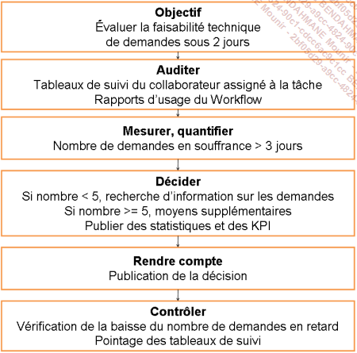

Le collaborateur prépare chaque semaine un tableau de suivi dans lequel il consigne l’ensemble des demandes traitées ou encore en attente. Chaque ligne du tableau explicite des conditions particulières et qui sont indispensables à l’évaluation de la faisabilité. Par ailleurs, le workflow de traitement repose sur un outil informatique capable de produire des statistiques d’usage. Le chef de projet peut ainsi confronter les deux informations, l’une très détaillée (mais peut-être pas à jour quantitativement) et l’autre plutôt générale.

Lorsque certaines demandes ne sont pas traitées dans les trois jours, elles passent en alerte. Ces alertes requièrent une décision de la part du chef de projet, lequel énonce l’instauration d’une nouvelle règle de fonctionnement. Lorsque le nombre est inférieur à cinq, il demande des éclaircissements sur les circonstances des demandes bloquées. Dans le cas contraire, il faut se rendre à l’évidence, les moyens manquent.

La règle instaurée est publiée pour que l’ensemble des personnes impliquées dans le processus de validation soit mis au courant. Après coup, le chef de projet doit contrôler régulièrement l’évolution des statistiques et les tableaux de suivi pour s’assurer que le nombre de demandes insatisfaites baisse.

### L'organisation du chef de projet

Le chef de projet assure quantité de tâches liées à l’organisation :

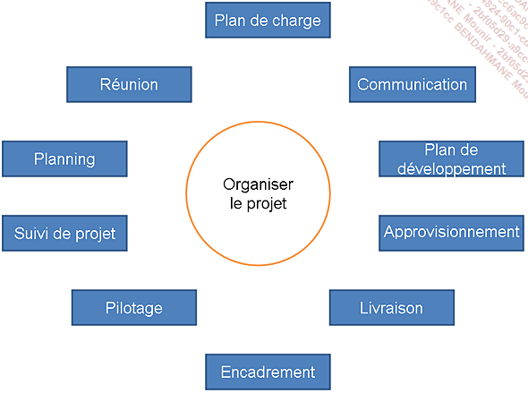

La préparation du plan de charge est une étape importante qui repose sur l’estimation du travail restant et sur les ressources affectées au projet. Cette estimation évolue au cours du temps, d’abord parce que de nouvelles tâches sont constamment ajoutées (les imprévus), mais aussi car il est presque impossible de chiffrer avec une grande exactitude un projet dont la charge dépasse quelques centaines de jours.
Le plan de charge est ensuite confronté au plan de développement qui indique les grandes étapes de la réalisation d’un projet, ou (ce qui revient un peu au même) les interactions entre les projets. Bien entendu, l’un influence l’autre et le chef de projet peut être amené à modifier son plan de charge pour tenir compte de contraintes fortes, ou au contraire à agencer son plan de développement pour optimiser l’affectation de ses ressources.

Au quotidien, le chef de projet gère le planning de ses équipiers ; nous verrons un peu plus loin comment le planning est d’abord assemblé puis maintenu au jour le jour. Cette activité représente un travail conséquent et des outils adaptés s’avèrent vite indispensables pour en venir à bout.

Le recueil et le traitement des comptes rendus d’activité entrent dans la catégorie des tâches de suivi de projet ; les plannings sont bien entendu affectés par ces pointages qui annoncent la clôture de certaines tâches et le démarrage d’autres.
Le pilotage est une activité où le chef de projet prend du recul et contrôle, en comité, l’exécution de son projet dans le respect des règles de fonctionnement de l’entreprise. Le comité de pilotage intervient pour faire évoluer le processus de réalisation de manière à le rendre plus rationnel ou plus dynamique.

Nous avons découvert que l’encadrement des équipes reposait sur une méthodologie précise qui entre dans la catégorie des tâches liées à l’organisation du projet : lorsque l’application de cette méthode ne permet pas de réaliser sans heurt les tâches, le chef de projet procède à des changements dans l’affectation des ressources. Il peut ainsi renforcer certaines équipes, responsabiliser ou remotiver des personnes, décharger, écarter ou en faire former d’autres.

Conduire un projet exige aussi de prendre la parole et d’assurer des opérations de communication (promotion, avancement, arbitrages...). Élément central et fédérateur, le chef de projet est naturellement impliqué dans ces opérations. Toutefois, il peut bénéficier de l’appui de services dédiés.

Les réunions sont planifiées, organisées et conduites par le chef de projet. Leur organisation suppose l’établissement d’un ordre du jour, d’un horaire, et sans doute la réservation d’une salle appropriée, équipée des moyens nécessaires à la tenue des réunions, ordinateurs, réseaux, vidéoprojecteurs...

Le chef de projet a la charge de l’approvisionnement en moyens matériels, logiciels et logistiques pour conduire ses opérations dans de bonnes conditions. Cet approvisionnement réclame parfois du temps pour négocier des prestations, des prix, des délais, des demandes d’achat... Cette activité n’est certainement pas à sous-estimer car elle peut s’avérer rapidement envahissante, voire embarrassante.

Les livraisons sont aussi sous la responsabilité du chef de projet qui contrôle les entrées (apport des fournisseurs) et les sorties (remises au client). Nous découvrirons à la section Le suivi et le pilotage comment sont organisées ces livraisons.

Compte tenu de toutes ces activités, il n’est pas surprenant que les tâches d’organisation puissent représenter jusqu’à 15 à 20 % de la charge totale du projet.

### La gestion des ressources

1. Le plan de charge
   Le plan de charge représente le rapport entre le nombre de jours d’engagement et le nombre de jours potentiels de réalisation d’une ressource.

Une ressource chargée à 50 % est donc disponible la moitié du temps. Toutefois, cette valeur traduit mal la disponibilité réelle des personnes. Il s’agit plutôt de valeurs cibles qui expriment leur engagement maximal, compte tenu d’activités annexes ou de responsabilités particulières.

Ainsi, les chefs de projet sont rarement chargés au-delà de 60 %, les 40 % restant étant partagés entre l’encadrement et l’organisation. Les délégués du personnel, les managers, les membres de groupes d’experts ont aussi des activités en dehors des projets qui vont peser sur leur plan de charge.

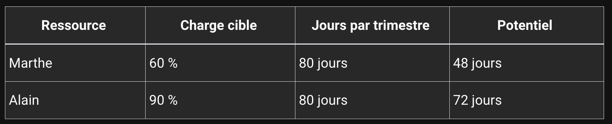

Communément, le plan de charge est défini sur un horizon temporel donné (par exemple un mois, un trimestre) et il est réactualisé au cours de l’année. On peut le représenter sous la forme d’un diagramme de Gantt, de tableaux ou d’histogrammes qui indiquent au chef de projet le potentiel de réalisation de son équipe.

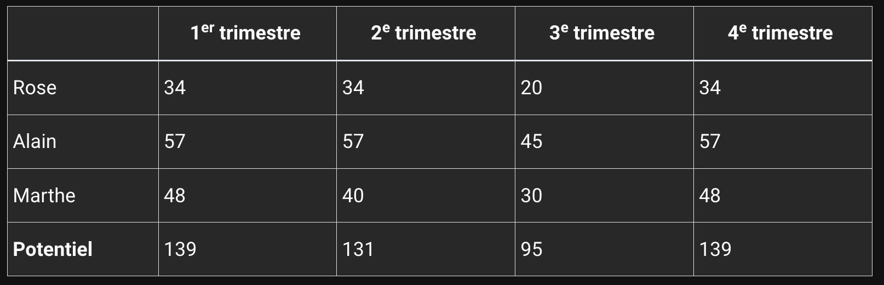

Les congés, formations et autres indisponibilités sont alors introduits dans le calcul. Ainsi, le chef de projet a une vision précise de son plan de charge potentiel.

La charge est ensuite fractionnée et partagée entre les différents projets ; c’est l’engagement des ressources.

2. La montée en charge et la disponibilité
   Les ressources engagées sur un projet ne sont pas immédiatement opérationnelles à 100 %. Il leur faut du temps pour prendre connaissance du contexte et définir leur propre organisation afin de mener à bien les tâches qui leur sont affectées.

Au sein d’un projet, passer continuellement d’une tâche à l’autre n’est pas une chose aisée, et le chef de projet doit veiller à préserver les ressources les moins expérimentées qui pourraient vite se perdre dans de tels agencements.

Passer d’un projet à l’autre est encore plus difficile. Seuls les experts ayant l’habitude de distribuer leur temps entre plusieurs thèmes réussissent à s’accommoder de cette situation.

Inversement, certaines personnes ont besoin de varier les exercices. Les affecter durablement sur des tâches répétitives entame leur motivation et leur efficacité. Pour limiter ce phénomène, le chef de projet peut intercaler des séances courtes (deux heures en fin de journée) de formation ou de veille technologique. Il peut aussi confier temporairement des responsabilités supplémentaires aux membres de l’équipe qui trouvent la phase de projet un peu monotone.

3. La surcharge
   La surcharge intervient lorsqu’une ressource au moins doit accomplir plus de travail qu’une journée ne peut en représenter. Les diagrammes de Gantt peuvent aider le chef de projet à détecter ces périodes, à moins qu’il ne dispose d’un outil d’analyse automatique.

Sur de très courtes périodes, et avec un personnel expérimenté, la surcharge peut être un moyen de se sortir de coups durs. Mais elle va rapidement conduire à une baisse de qualité, à une démotivation des ressources, et finalement à une déstructuration de l’équipe tout entière.

Il vaut mieux dans la majorité des cas retravailler le planning pour éviter les mises en parallèle inopportunes, par exemple en faisant appel à de la main-d’œuvre supplémentaire.

4. Gestion des ressources Cloud
   L’essor du Cloud a imposé un nouveau modèle économique : la facturation est fonction de la consommation. Cette modalité s’applique en particulier aux environnements d’exécutions (Platform as a Service), aux infrastructures à la demande (Infrastructure as a Service) et bien sûr aux services logiciels (Software as a Service).
   Par conséquent, le chef de projet doit veiller à ajuster le dimensionnement de ses ressources Cloud en fonction de la phase du projet et du nombre d’utilisateurs.

Les principes d’allocation sont les suivants :

Demander un environnement de développement suffisant pour construire la solution mais sans atteindre le niveau de performance correspondant à une pleine charge de données et d’utilisateurs.

Optimiser les environnements de test pour permettre le déploiement d’une release sur l’environnement A pendant qu’une autre version est testée sur B. Si le cadencement des tests le permet, limiter à un seul environnement de test.

L’environnement de test de charge est mis en sommeil entre deux tirs. L’équipe doit vérifier auprès du fournisseur d’infrastructure que les performances délivrées par la plateforme restent constantes après chaque tir. Il arrive fréquemment que les performances fournies soient lissées sur une période d’un mois.

Le dimensionnement de l’environnement de production est ajusté à la hausse ou à la baisse en fonction de la charge des utilisateurs et du volume de données à traiter.

Le coût de stockage est généralement très bon marché pour inciter à l’ancrage d’une solution sur une plateforme donnée. Si l’upload (copie des données vers le Cloud) est financièrement attractif, le coût du download peut être prohibitif pour dissuader toute velléité de changement de fournisseur Cloud. Le choix initial et les préétudes d’architectures s’avèrent donc déterminants quant à la dernière ligne du budget d’hébergement.

Comprendre une grille tarifaire Cloud n’est pas chose aisée. Tout a l’air bon marché, et l’estimation des volumes, flux, bandes passantes… peut virer au cauchemar. D’un autre côté, le surdimensionnement de l’infrastructure peut s’avérer ruineux. Si une équipe d’architecture est confrontée à des problèmes de performances, elle peut recourir à une solution d’analyse de la performance applicative (APM - Application Performance Monitoring) comme Dynatrace ou New Relic pour l’aider à diagnostiquer les composants en cause, et proposer ainsi un plan d’optimisation de la performance à un coût maîtrisé.
