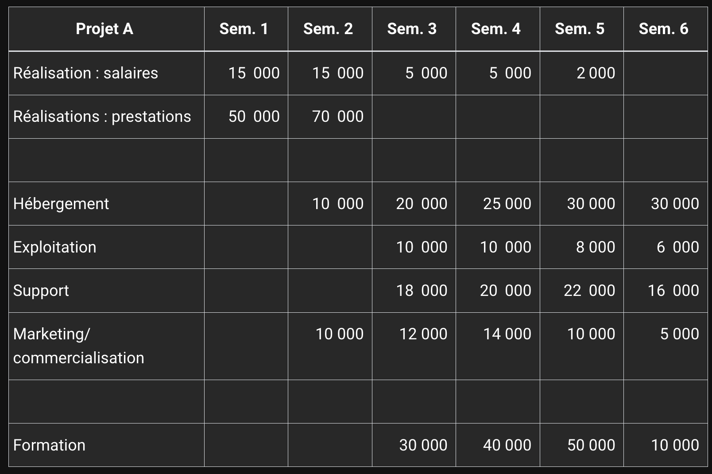

# Techniques avancees de gestion de projets

## Démarrer un projet informatique

Quelle aventure excitante la formation et le démarrage d’un projet informatique ! On a tous en mémoire le vécu d’un projet dont on conclut : « ça a été une période intense ! » ou encore « oh la, il y a eu tellement d’embûches ! » mais aussi « on a réussi à livrer dans les temps ».

Quelle que soit la durée du projet, de quelques jours à plusieurs mois, le récit dépend beaucoup du point de vue. Le commanditaire minimise la complexité de la demande pour focaliser sur les bénéfices apportés par les résultats du projet. Le chef de projet est naturellement beaucoup plus à même de souligner les contraintes à surmonter. L’un et l’autre sont en rapport, c’est même la définition de la création de valeur qui est présentée au chapitre Les aspects financiers et juridiques.

La réussite du projet est-elle une grande responsabilité ? Tient-elle de l’exploit, de la chance, d’un savoir-faire particulier ? Il y a un peu de tout cela, une combinaison de l’organisation avec d’autres disciplines, autant de rôles que le chef de projet va incarner tel un chef d’orchestre.

Le chef de projet imprime tout d’abord le rythme, c’est lui qui démarre la réalisation et donne le top départ du lancement des activités.

C’est aussi lui qui veille au respect de la fréquence des échanges entre les parties prenantes tout au long du projet. Voilà un point capital pour éviter les malentendus souvent lourds de conséquences : besoin incomplet ou mal défini, enjeux et objectifs non formulés, équipe de réalisation fonctionnant dans une tour d’ivoire, client laissé dans l’ignorance des événements notables du projet.

Tout projet comprend une part personnelle apportée par les membres de l’équipe. Le chef de projet n’est pas seulement un gestionnaire du planning ; c’est d’abord un manager qui entretient et maximise la motivation pour aboutir. Il veille à la bonne tenue du cap, au respect du cadre et à la bonne entente au sein de l’équipe.

Démarrer un projet, rien de plus simple : identifier les enjeux puis formuler les objectifs. Cette démarche est à la fois le point de départ du projet mais aussi son horizon d’arrivée. L’équipe va se frayer un chemin entre ces deux situations, suivant un itinéraire unique.

### Identifier les enjeux

L’identification des enjeux est la première étape, elle est primordiale. Quelles sont les motivations pour engager ce projet ? Qu’est-ce qui est important par différence avec ce qui est secondaire ? Quels sont les critères pour réussir le projet ?

Il n’y a pas de méthode infaillible pour répondre à ces questions, d’autant que des projets sont formés dans des situations très diverses : lancement de produit ou de service, appel d’offres, plan d’action… Les causes sont grandes ou petites, et l’identification des enjeux tout aussi nécessaire.

Considérons un projet de taille significative. Sans enjeu déterminé, l’engagement des moyens - équipes et ressources - sera forcément limité. Ceci constitue déjà un risque d’échec élevé.

Mais les petits projets doivent également identifier leurs enjeux, sous peine de privilégier la réalisation au détriment de l’organisation et du pilotage.

Le plus souvent, les enjeux d’un projet entrent dans un cadre stratégique d’entreprise ou d’organisation : renforcer des positions commerciales, attaquer de nouveaux marchés, transformer l’organisation, rationaliser, nouer des partenariats, fidéliser des clients, développer des usages…

Il est généralement admis que la liste comprend deux à quatre enjeux majeurs ; naturellement, il ne s’agit pas d’une règle absolue. Un seul enjeu peut avoir du sens si on vise « assez loin » pour ne pas se lancer dans du trop spécifique. Inversement, trouver une multitude d’enjeux principaux pose la question de l’étendue du projet et de la granularité de ses objectifs.

La liste des enjeux peut faire référence à la stratégie suivie par l’organisation (par exemple « être numéro un sur notre marché »), elle peut contenir des éléments chiffrés (« diviser par deux le nombre d’anomalies annuelles ») ou mentionner un dispositif existant (« ce panel fournit des indicateurs depuis cinq ans »).

Exemples :

- Fiabiliser la mesure de satisfaction des usagers concernant la qualité de service.

- Maximiser l’indice de satisfaction concernant la qualité de service.

- Rendre compte aux usagers de l’évolution de l’indice de satisfaction et des actions réalisées.

### Formuler les objectifs

Les objectifs du projet fixent dans les grandes lignes les besoins en reformulant les enjeux des réalisations à venir. Définir les objectifs, c’est répondre à la question : « que veut-on obtenir ? ».

À ce stade, on évoque le futur produit mais on ne parle pas encore de la façon d’y parvenir. Soulignons que même dans le cadre des méthodes agiles qui s’accommodent fort bien d’un besoin évolutif (voir le chapitre Rendre les projets agiles), il existe une étape de projection vers un résultat recherché, et ceci à chaque sprint (voir le chapitre Rendre les projets agiles).
Cette démarche de projection fait donc abstraction des contraintes habituellement mises en avant par les équipes de réalisation ; au contraire, conditionner l’atteinte d’un objectif à telle ou telle difficulté a pour conséquence d’introduire des facteurs de surcoût dès le début du projet.

L’énoncé des objectifs est à la fois simple - puisque l’on doit s’affranchir des contraintes - mais n’est pas naturel. Les équipes de réalisation ont tendance à s’autolimiter, tout comme les demandeurs, de peur d’obtenir une estimation (également appelée chiffrage) astronomique, laquelle remettrait en cause l’ensemble du projet.

Exemples :

- Publier les rapports de satisfaction de qualité de service.

- Mesurer la satisfaction de qualité de service après chaque transaction.

- Comparer les indicateurs de satisfaction de qualité de service d’une année sur l’autre.

### Définir le périmètre

Voici l’étape qui installe le projet dans son cadre. Le périmètre du projet définit sa portée, ses limites théoriques en quelque sorte, et on précise pour cela ce qu’est le projet, ainsi que ce qu’il n’est pas.

Comment procéder ?

Une première approche consiste à lister ce qu’est le projet, en détaillant (un peu) les objectifs, puis à lister quelques éléments réputés hors périmètre. Cette méthode, qui peut paraître empirique, est néanmoins employée dans nombre de cahiers des charges et autres appels d’offres, preuve s’il en est de son efficacité en dehors de tout formalisme standardisé.

Une deuxième approche nécessite de réaliser une estimation grossière pour calibrer le projet, déterminer son coût approximatif, sur la base d’un nombre de jours de réalisation ou d’un budget financier plus étayé. Toutes les techniques d’estimation sont pertinentes à ce stade, par comparaison, par analyse, par abaque… Même dans le cas des projets évolutifs ou agiles, on devra de toute façon encadrer le nombre de jours consacrés au projet.

L’estimation du nombre de jours à passer sur le projet est déterminante.

D’une part, elle donne une indication sur l’étendue des demandes. A-t-on suffisamment de matière pour déclencher un projet ? Et aussi, n’a-t-on pas vu trop grand ? D’autre part, l’estimation va être convertie en montant financier, c’est l’enveloppe nécessaire à la réalisation du projet. Si le budget n’est pas garanti, alors le projet ne pourra pas se faire. L’estimation des charges fournit aussi une indication du temps que mettra l’équipe pour réaliser le projet avec un niveau de qualité standard, c’est-à-dire en disposant de périodes de spécifications, de tests, de documentation…

Quel est le bon équilibre entre l’étendue des demandes, le délai de réalisation, le coût du projet et le niveau de qualité ? Cela peut varier d’un projet à l’autre en fonction des enjeux du projet. On peut privilégier le délai de réalisation pour sortir rapidement un nouveau produit ou bien insister sur la qualité ou la richesse fonctionnelle pour se démarquer d’un produit existant. Le coût peut être aussi un élément primordial du projet.

La matrice QCD (Qualité, Coût, Délai) représente ces différentes dimensions. On ne peut pas tout optimiser simultanément, mais si on fixe certaines exigences, alors les autres sont des axes de compensation (trade-off) pour rendre l’équation soluble.
Le coût dépend beaucoup du délai global pour mener le projet ; mais des périodes où l’activité est réduite peuvent être mises à profit pour diminuer le nombre de personnes affectées au projet et en fin de compte réaliser des économies sur le long terme.

Le niveau de qualité exigé sur le produit du projet influe à la fois sur les délais et sur le coût. Il faut envisager la qualité comme un niveau de performance à atteindre et pas seulement comme un nombre de défauts plus ou moins visibles, voire acceptés.

Exemples :

Dans le domaine réglementé des logiciels financiers, la fiabilité des résultats est de rigueur.

L’équipe dispose de six mois pour réaliser le projet de création d’un module de calcul d’amortissements, ce qui paraît adéquat pour une charge estimée à quatre-vingts jours-hommes. Plusieurs algorithmes de calcul sont disponibles sur le marché, certains sous licence commerciale se montrent très efficaces pour fournir instantanément leurs résultats.

La priorité doit être donnée à la maîtrise du budget et à la fiabilité des calculs, mais la vitesse des calculs n’est pas l’exigence première.

## Elaborer le projet

### Dimensionner le projet

On se rapproche tout doucement de la phase operationnelle du projet. C'est le moment de proceder au casting de l'equipe de realisation.

Loin de se limiter à la question du délai global, le dimensionnement se préoccupe de bien d’autres domaines comme les compétences requises, le contexte particulier (économique, stratégique, réglementaire…), le degré d’industrialisation ou au contraire la part de recherche et développement.

Dimensionner le projet, c’est prévoir quelles ressources seront affectées sur quelles durées.

On parle en premier lieu des ressources matérielles (ordinateurs, serveurs, d’autres types d’équipement), d’actifs logiciels (licences, applicatifs) ou encore de services logiciels (stockage, entrepôts de code sources, services Cloud…).

Le chef de projet va commencer à répertorier et orchestrer l’emploi de ces ressources, cela va servir de base à la construction du budget.

Pour mener à bien cette cartographie des ressources, le chef de projet définit l’échelle temporelle : le délai global du projet se compte en jours, en semaines, en mois ou en années. L’affectation des ressources et leur coût unitaire se fait en minutes, en jours, en semaines, etc. Cette échelle est variable d’une ressource à l’autre, certains services SaaS (software as a service, accès locatif à des services logiciels) sont facturés à la seconde tandis que l’acquisition d’un serveur de calcul peut être amortie sur plusieurs mois.

Exemple d'estimation :

Le chiffrage atteint 240 jours à fournir avec une équipe de 6 personnes affectées à temps plein sur le projet. En moyenne, chaque personne travaillera 240 / 6 = 40 journées. Empiriquement, la durée du projet est de 40 / 5 = 8 semaines de réalisation.

À partir de cette base théorique où toutes les tâches sont indépendantes et peuvent être réalisées en parallèle, le chef de projet précise le plan de charge. De façon plus réaliste, la durée du projet s’allonge de deux à trois semaines pour tenir compte notamment des dépendances entre tâches et de la disponibilité individuelle des équipiers.

### Constituer l'équipe

La constitution de l’équipe projet est une affaire de personnes, d’alignement des compétences entre les besoins et les disponibilités, mais aussi un acte de management. Réunir une équipe, c’est fédérer des compétences autour d’un projet et entretenir la motivation pour atteindre ses objectifs.

Or, certains rôles complémentaires ont des modes de fonctionnement parfois opposés : le développeur code rapidement tandis que le testeur prend le temps d’éprouver une à une les fonctionnalités. Dans son rôle de leader, le chef de projet est à la fois le gardien du niveau de qualité défini (au sens de la complétude des livrables et de leur conformité) mais aussi le manager d’une équipe.

Sans concéder aux exigences de qualité et de performances, la constitution de l’équipe tient compte des personnalités et du respect d’un « savoir travailler » ensemble. Il y a ainsi des combinaisons de personnes qui fonctionnent mieux que d’autres.

La taille de l’équipe dépend beaucoup de l’organisation (de l’entreprise) en charge du projet ; toutes les compétences sont-elles disponibles ? Des recrutements sont-ils nécessaires et envisageables, en embauche ou en prestation ? Le recrutement, y compris d’un prestataire, peut prendre du temps et retarder le projet. Dans certains cas, le chef de projet doit bien entendu prendre un risque calculé en prenant en compte la durée du projet, les coûts de personnel et les compétences nécessaires à la réalisation du projet.

Exemple :

Ce projet de développement logiciel réclame des compétences métiers spécifiques. Trois personnes dans l’organisation sont identifiées pour participer. Jocelyn est un expert, il a une vision très claire du métier, il est reconnu pour ses compétences mais se montre parfois intransigeant si on n’adhère pas entièrement à son point de vue. Romy a rejoint l’entreprise l’an dernier, elle n’a pas encore participé à des projets de ce type mais elle s’est montrée très intéressée lors de la présentation du projet. Enfin, Khalid est une valeur sûre, rompu à la réalisation de ce type de solutions mais très sollicité, il est en quelque sorte victime de son succès !

Le chef de projet pourrait d’abord proposer à Romy de rejoindre l’équipe. Bien que moins expérimentée, sa motivation sera un atout. Par ailleurs, il serait dommage que Khalid accepte de participer alors que ses autres projets l’accaparent. Enfin, il a été porté à la connaissance du chef de projet que Jocelyn ne s’entend pas avec l’équipe de développement.

### Commencer le projet

Qu’est-ce qui matérialise le projet ? Ce n’est pas la production de livrables ou la distribution de consignes ni même l’établissement d’un planning. Il faudra bien s’y mettre, mais un projet n’existe pas sans gouvernance et sans moyens d’atteindre l’objectif.

La gouvernance du projet constitue son cadre de décision, c’est une convention passée avec les parties prenantes. Le chef de projet est chargé de piloter des ressources (humaines, matérielles, budgétaires) engagées pour réaliser quelque chose. La gouvernance fixe les règles du jeu et en particulier les instances de pilotage du projet. On parle parfois de comitologie pour définir les réunions, les participants, les objectifs, les moyens…
Quand la convention de gouvernance est passée, elle s’applique aussitôt ; le projet démarre.

## Cas d'etude pour les exemples de cours

### Cas d'étude : projet de mise en place de CRM

CRM: Customer Relationship Management

1. Contexte

La Société de **Conseil Plus** compte deux-cents personnes sur deux sites implantés dans de grandes villes, capitales économiques de leurs régions respectives. Les associés exercent une activité exécutive et en même temps opérationnelle. La société dispense des conseils aux professionnels, aussi les associés disposent d’une relative autonomie dans le développement de leurs affaires. La présidence tournante au sein du comité de direction vient de changer, et celle-ci, sur la recommandation de la direction administrative et financière, a fait le choix stratégique d’attaquer un nouveau marché du conseil.

Ce choix implique le développement rapide de réseaux de clients et de prescripteurs, ainsi qu’une transformation rapide des opportunités en vente. La rentabilité viendra du volume d’affaires réellement mis en œuvre, chaque opération pouvant représenter plusieurs dizaines de comptes qui aujourd’hui sont traités un par un.

La direction administrative et financière comprend le secrétariat général, le service communication et le service marketing. Les activités de conseil sont organisées en pôles, dirigés par des associés.

La direction générale a chargé la DAF (directrice administration et finances) de mettre en œuvre la constitution d’une base de données « gestion de la relation client » qui soit orientée vers le développement de réseaux et l’analyse d’opportunités.

2. Besoin exprimé

La DAF a tenté de structurer par elle-même une base de données des contacts transmis par les associés dans leurs opérations de prospection (des cartes de visite, des mémos, des mails…), mais aussi à partir du fichier client. Il en résulte un listing comprenant plusieurs milliers de contacts, en grande majorité peu qualifiés. De plus, le circuit d’acquisition et d’enrichissement n’est pas bien rodé, et de nombreux contacts font l’objet d’un traitement manuel (qualification, mise à jour, recoupement, recherche d’antériorité, suppression des doublons…).

Durant le dernier comité de pilotage, la DAF a recommandé d’orienter le projet sur une autre approche, la mise en œuvre d’un outil de CRM, dans le but évident de ne pas réinventer quelque chose qui existe par ailleurs. Outre les fonctionnalités standards d’un tel outil (gestion des contacts, analyse multicritère, suivi des opérations commerciales…), des critères de simplicité et d’efficacité, de polyvalence, d’intégration avec les outils bureautiques et les équipements mobiles ont été retenus.

Le projet piloté par la DAF est confié à Annie, responsable du marketing, laquelle est nommée chef de projet.

3. Cadre du projet

Des consultations sont lancées auprès d’éditeurs de logiciels et d’intégrateurs de solutions CRM. Le comité de pilotage a proposé une mise en œuvre dans les six mois qui suivent la sélection d’un fournisseur. Le processus de sélection est prévu pour une durée de deux mois.

La DAF n’a pas encore budgété cette opération qui se déroulera sur le prochain exercice. Elle envisage de consulter trois à quatre prestataires et de mettre en compétition les deux meilleurs suivant la méthode dite de dialogue compétitif.

La chef de projet sera assistée de Guillaume, responsable système, employé par une société de services informatiques détenue partiellement par la Société de Conseil Plus.

Annie et Guillaume entreprennent la rédaction d’un cahier des charges reprenant les besoins fonctionnels identifiés ainsi que les contraintes techniques connues. Ce document d’une quinzaine de pages a été soumis à la DAF avant que les premiers contacts soient initiés auprès des fournisseurs potentiels.

4. les enjeux du projet

La décision stratégique d’investir de nouveaux marchés résulte de l’analyse d’un business qui évolue. Les interactions sont plus courtes et plus fréquentes. Hommes d’affaires aguerris, les associés sentent le vent tourner et veulent capter un marché structuré qui pourrait se déliter en petits morceaux, faisant les beaux jours d’acteurs éphémères et nettement moins importants. La présidence compte bien assoir la société sur la plus haute marche du podium et conforter sa place de leader au sein du board.

Avisée, la DAF réalise l’impérieuse nécessité d’améliorer la productivité dans un domaine resté jusque-là très indépendant des processus habituellement sous son contrôle. C’est aux associés que revient la tâche de développer les affaires, c’est à la DAF de fournir des outils adaptés. De fait, la détermination de la rentabilité (ROI ou Return On Investment) sera délicate à établir et à partager avec le board.

Annie, la chef de projet, a vite décelé l’opportunité d’élargir son champ de responsabilité, y compris après le franchissement de l’étape lancement. Guillaume, même s’il ne perçoit pas la visée stratégique du projet (celle-ci n’a pas été dévoilée en dehors du board), y voit un moyen de renforcer la coopération entre son entreprise et la Société de Conseil Plus, à la fois actionnaire et cliente.

### Cas d'étude : developement d'une application de pilotage

4U Production est une maison de production web fonctionnant par crowdfunding (financement participatif). Elle met en relation des internautes dans le but de financer des productions d’œuvres artistiques digitales. Lancée il y a quatre ans par un duo d’entrepreneurs audacieux, JP et Dan, la compagnie de production a connu ces derniers temps un essor fulgurant. Afin d’étoffer ses effectifs permanents, trois nouveaux cadres ont été recrutés.

François est directeur des opérations, il est en charge de l’administration des ventes (encore embryonnaire) et de l’organisation des événements de promotion.

En tant que directrice de projets, Samantha a la responsabilité de suivre la réalisation des œuvres ; elle veille à ce que l’argent des internautes soit réellement dépensé pour leur production. Son quotidien est donc fait de réservations de studios d’enregistrement et de postproduction, de commandes de galeries digitales et de rendez-vous avec les artistes.

William est le nouveau patron des commerciaux. Il vient du monde de la presse en ligne où il a dirigé des régies publicitaires. Il va maintenant établir des dossiers de partenariat entre internautes et artistes, récupérant pour l’entreprise un pourcentage des fonds collectés et prévoyant des événements de promotion sponsorisés par d’authentiques clients.

a. Analyse de la situation et perspectives
Les fondateurs, JP et Dan, sont des marketeurs de haut vol, passionnés par leur métier, débordants de nouvelles idées et de projets à enclencher. Mais l’embauche de nouveaux talents a été conduite à marche forcée afin de ne pas perdre prise avec la réalité des affaires. Samantha, François et William ont de grandes qualités professionnelles, cependant leurs méthodes de travail sont très éloignées les unes des autres.

Samantha a travaillé longtemps comme freelance avant de rejoindre l’équipe exécutive. De cette époque, elle a conservé ses tableurs et ses cahiers pour assurer le suivi de ses projets. François est un administrateur né, il a l’habitude de planifier et dérouler ses opérations sans admettre la moindre entorse aux procédures et dispositifs. William est un directeur des ventes expérimenté, flairant les opportunités et assez à l’aise vis-à-vis des procédures trop contraignantes. Avec lui, pas moyen de rater une affaire !

JP et Dan n’organisent pas systématiquement de grandes réunions formelles à horaires fixes, mais ils ont cette fois convié tout le monde autour de la table. Il va falloir s’organiser, et rapidement. Autrement, l’entreprise ratera son passage en mode industriel, sans visibilité sur sa rentabilité et ses perspectives.

Il est décidé de développer un outil de pilotage d’activité maison qui soit utile à l’ensemble du personnel permanent. Jérôme, qui travaillait jusque-là comme webdesigner intérimaire, se voit proposer un poste permanent avec un élargissement de sa mission : il est promu chef de projet de l’application pilotage d’activité ! Les fondateurs annoncent également l’arrivée d’un directeur juridique qui a travaillé dans un grand cabinet d’audit et de conseil. Bien que missionné pour le contentieux et les affaires juridiques de l’entreprise, sa réputation le précède et on sait déjà qu’il a des idées très précises sur la gestion des processus d’entreprises.

b. Résumé des exigences
JP et Dan souhaitent avoir une vision prospective de leurs affaires, tandis que François a besoin de connaître en temps réel la situation des opérations en cours. Après réflexion, les besoins de Samantha et William sont similaires, toutes les opérations et négociations seront intégrées à cet outil.

Il est convenu qu’une petite entreprise telle que 4U Production s’épargnera la mise en œuvre d’un système ERP (Enterprise Resource Planning, ou progiciel de gestion intégré), réputé complexe à déployer. Les dirigeants, très créatifs, optent plutôt pour la production d’indicateurs numériques et graphiques.

Les indicateurs, actualisés périodiquement, seront affichés sur de grands écrans aux endroits clés des bureaux de l’entreprise, salle de réunion créative, cafétéria, et sur la première page de l’intranet.

c. Dotation et contraintes
Les dirigeants conçoivent un projet à leur image, entrepreneurial, rapide et qui ne sollicite pas trop la trésorerie. Jérôme dispose de trois mois pour le réaliser, et doit s’organiser à mi-temps, poursuivant ses travaux d’infographie en parallèle. Il aura l’appui du personnel permanent qui a reçu comme consigne de consacrer au moins une journée par semaine aux différents ateliers.

Le développement informatique sera confié à une équipe constituée de freelances déjà en place et habituellement pilotée par Jérôme.

d. Les enjeux du chef de projet
Chacun tient malgré tout à son indépendance, et la mise en commun des informations de suivi ne rime pas avec une normalisation des processus. C’est un point que devra surveiller Jérôme s’il veut que le projet aboutisse. D’autant que Hubert, le nouveau directeur juridique, semble bien tenté d’apposer sa patte sur le fonctionnement de l’organisation.

Jérôme a d’ailleurs été retenu comme chef de projet car il connaît déjà bien le fonctionnement de l’entreprise et ne cherchera pas à transposer un modèle issu d’une autre expérience professionnelle. Mais il va devoir prendre du recul, s’investir dans de nouveaux domaines, analyser les méthodes de chaque directeur et trouver une cohérence dans le rendu des indicateurs sans pour autant renoncer aux particularités.

Chaque directeur suit son propre rythme, ajoute ses contraintes, dispose déjà de ses indicateurs, et le chef de projet comprend ainsi le sens de sa mission : trouver une organisation qui fédère et rationalise différentes approches ad hoc du pilotage.

C’est donc un projet dans lequel la dimension métier et le relationnel sont au premier plan. Plus coutumier de projets à dominante technologique, Jérôme dispose d’un tremplin pour progresser.

### Creation d'un site e-commerce

Stéphanie a passé plusieurs années dans une ESN (entreprise de services du numérique) de renommée mondiale. Elle y a occupé différents postes jusqu’à obtenir celui de manager. Fonceuse et charismatique, son équipe n’a pas hésité à la suivre lorsqu’elle a annoncé son départ pour fonder le site de vente en ligne On’Troc.

Son projet est le fruit d’une discussion impromptue avec Yves, un dirigeant de la société de services, qui lui a fait découvrir le modèle économique des startups et indiqué que des fonds pourraient être injectés par l’incubateur si elle présentait un cas d’affaire (business case). Quelques nuits de travail acharné plus tard, le plan était cadré et étudié en avant-première par Yves. Celui-ci observa que le projet de Stéphanie était à la fois audacieux, excitant et prometteur. Le fonds d’investissement serait prêt à débloquer des sommes conséquentes pour s’associer à l’essor commercial de la société dirigée par Stéphanie.

Yves a mis Stéphanie en contact avec Ernest, consultant senior détaché du fonds d’investissement chargé d’affiner le projet. En effet, l’apport des conseils relatifs à la création de l’entreprise, son établissement et le recrutement d’une équipe sont aussi déterminants que la levée de fonds.

a. Des moyens conséquents au service d’un projet unique
Revenons au projet : le capital investi est assez important pour assurer deux ans de trésorerie avec cinq salariés. Toutes les prestations de recherche et développement de ventes sont sous-traitées pour ne pas représenter de charges fixes. Des locaux confortables et fonctionnels sont loués afin d’établir le siège social et d’accueillir collaborateurs, partenaires et fournisseurs.

Les formalités de création de l’entreprise sont bouclées assez rapidement par Ernest, qui conduit la plupart des opérations administratives. Stéphanie se concentre sur la composition de son équipe. Ses collaborateurs actuels sont tellement performants qu’elle espère en débaucher un ou deux. Elle constate avec satisfaction que bien plus de candidatures issues de son équipe lui sont adressées.

Secrétaire général officieux, Ernest a procédé à la rédaction des contrats de travail et il a recommandé une structure de rémunération très stimulante en regard de ce projet unique : la création d’une entreprise.

b. De la stratégie au plan projet
Stéphanie doit maintenant présenter le détail de sa stratégie et trouver avec son équipe un plan de réalisation adéquat. De nombreuses projections financières sont nécessaires, et quelques-unes d’entre elles sont validées par le fonds d’investissement. Le capital n’est en effet pas complètement libéré et un contrôle très strict des engagements financiers est opéré par l’incubateur. Celui-ci fait un peu office de banquier et il entend compenser les risques pris par une visibilité sur la rentabilité de l’affaire.

Au bout de quelques semaines, le plan se dessine et la proposition de valeur est détaillée au comité d’investissement. Suivront des études de marché et de nombreuses séances de simulation avant de pouvoir enfin envisager la phase de réalisation.

Lorsque le lancement officiel a été prononcé, l’équipe, euphorique, s’est rapidement mise à la tâche. Enfin du concret !

c. Les enjeux d’une équipe
Les collaborateurs de Stéphanie ne sont pas venus chez On’Troc par hasard. Ils ont été attirés par le défi de la création d’une entreprise où l’esprit pionnier est une valeur partagée, où tout est à inventer.

Cependant, cette entreprise nouvelle est détenue par un groupe puissant et structuré. L’équipe va devoir composer avec les contraintes d’un contrôle financier très strict et trouver rapidement sa marge de manœuvre afin d’atteindre les objectifs qu’elle s’est fixés.

Dans cet enchaînement d’étapes et de décisions, le but initial de Stéphanie s’est sans doute transformé. Partie pour « monter une affaire », elle doit maintenant se positionner comme chef d’entreprise et veiller à la pérennité de celle-ci.

Venus offrir leurs compétences opérationnelles, ses collaborateurs ont l’opportunité d’évoluer et de devenir de futurs directeurs. Les caractères et les ambitions personnelles vont bientôt se révéler. Il faudra à Stéphanie de la clairvoyance, elle devra compter sur toutes ses qualités de manager pour offrir le meilleur à sa nouvelle équipe.

### Creation d'une appli Sport

Quatre copains poursuivent le même but, se lancer des défis sportifs relevés. Ils ont tout essayé ou presque : le kitesurf, le ski de randonnée, la plongée sous glace, le trek en altitude… Désireux de partager et de monétiser leurs découvertes, la petite entreprise fondée il y a quinze mois est déjà très productive. Le nombre d’abonnés aux posts spectaculaires dévoilant des spots inédits attire déjà des sponsors.

a. Le défi d’une bande de passionnés
Assez rapidement, l’idée d’un moyen de communication électronique s’est imposée. Comment proposer des lieux originaux, élargir le nombre de sites visités sans avoir à recruter et à financer de coûteuses collaborations ? La priorité est de disposer d’une application pour mobiles, seul support vraiment adapté. Toutefois, les contours du projet de développement ne sont pas précisément arrêtés.

L’équipe, constituée de deux informaticiens et de deux commerciaux, s’est mis en tête de transformer cette expérience en revenus financiers. Dans une phase pionnière, le niveau de rentabilité attendu est assez facile à atteindre.

Pour résumer le cas d’affaires, il s’agit d’un développement informatique où tout est à inventer, à définir, et pour lequel les contraintes sont contournées plus que parquées dans des listes à épuiser dans de laborieuses réflexions.

b. Un projet à la mesure de sa communauté
L’équipe est convaincue que la valeur du projet tient dans la rapidité de sa croissance. Autrement dit, le code source est accessible dans le cadre d’un contrat de licence open source, et la communauté de développeurs devient le levier d’accélération. Ce principe de développement privilégie tout naturellement une organisation agile pour un projet en constante évolution, dont le périmètre correspond à la somme de ses contributions.

c. Développer et grandir avec la technologie
Dans un tel projet, les changements de cap sont fréquents et s’accompagnent de ruptures technologiques, de modifications radicales de la pile technique (ensemble des frameworks et composants logiciels qui composent l’architecture). La maîtrise du risque au sens informatique devient un élément central de pilotage. La valorisation de cette jeune entreprise dépend d’ailleurs largement de sa capacité à faire aboutir le projet.

## Aspects financiers et juridiques d'un projet

### La structure de cout d'un projet

Que l’on imagine un projet se dérouler au sein d’une société de services informatiques, chez un éditeur de logiciels, un intégrateur ou toute autre structure, les conditions économiques et financières sont omniprésentes et sous-tendent l’intégralité de l’activité. On a coutume de dire « pas de budget, pas de projet » pour rappeler que nul projet ne peut exister sans dotation.

Le chef de projet est au centre d’un dispositif qui consomme des ressources pour atteindre un but. Ce qui est finalement livré représente une valeur perçue par le commanditaire du projet. S’il s’agit d’un logiciel, celui-ci est par exemple vendu à ses utilisateurs et le commanditaire reconnaît un montant financier compatible avec les efforts et les espoirs (rendement) qui ont rendu possible la réalisation du projet.

Le cas des ouvrages « internes » n’est pas différent et, là encore, le chef de projet assure une double charge. Il doit d’abord évaluer l’ensemble des charges financières du projet (réalisation, exploitation, maintenance…) pour le comparer à ce qui pourrait être obtenu grâce à un dispositif externe. Il doit ensuite gérer au mieux son projet pour le conduire conformément aux prévisions.

La structure de coût projette sur un horizon temporel des postes de coûts fixes ou récurrents. L’échelle de temps dépend de la durée du projet, incluant l’exploitation de son produit, voire les réinvestissements.

a. Les salaires et prestations de réalisation
Ces postes représentent fréquemment jusqu’à 75 % des coûts d’un projet, en tous les cas sur la première année et jusqu’à ce que le produit rentre en maintenance. On considère généralement des montants chargés (+65 % du montant net) pour les salaires internes et des montants incluant les marges (markup) quand on se trouve du côté SSII (société de service et d’ingénierie informatique).

À compétence égale, le coût d’une SSII est un peu supérieur puisqu’il intègre la marge commerciale ainsi qu’une marge assurant le prestataire en cas d’intercontrats. Le markup (taux de marge) global se situe fréquemment à 1,6 (60 % plus important qu’un salaire). L’intercontrat - la période au cours de laquelle les ressources ne sont pas en mission - est une composante du risque qui peut servir de levier pour négocier un projet.

Des grilles de coûts

Les coûts d’une ressource dépendent des éléments suivants :

Le domaine de compétence (développeur, administrateur, architecte, graphiste…).

Le niveau de qualification et le degré d’expérience (débutant, confirmé ou expert).

Le champ d’application des compétences au sein du projet (c’est-à-dire l’adéquation entre les compétences proposées et les besoins du projet, ou encore le degré de connaissance de l’objet du projet).

Le salaire de la ressource (peut être lié à la durée de la carrière).

Le niveau de service pour le projet.

Les modalités d’emploi (sur site en régie, au forfait, en offshore - à l’aide d’une équipe délocalisée…).

Le chef de projet peut consulter des barèmes, publiés par la presse informatique ou par les cabinets de recrutement, pour situer sa structure de coûts ; ces grilles de coûts sont périodiquement actualisées et sont une base importante pour évaluer la fiabilité d’un chiffrage.

b. Négocier les coûts journaliers en régie
La négociation doit s’effectuer lorsque le périmètre exact du projet est connu, car le coût est principalement lié au nombre de jours nécessaires à sa réalisation. La durée de l’engagement est un levier de négociation important : meilleure est la visibilité du prestataire sur le plan de charge futur de ses ressources, moins l’hypothèse d’intercontrats est justifiée. On peut donc gagner jusqu’à 20 % du prix jour par ce biais. Pour arriver à ce résultat, le commanditaire peut chercher à mutualiser ses commandes pour allonger la période d’intervention du prestataire.

Puisqu’en régie tous les paramètres sont connus et partagés par les parties - prestataire et commanditaire - ce dernier peut ajuster le prix en modulant ses exigences : qualité des intervenants, niveau de service, modalités d’exécution…

La démarche de négociation doit rester équilibrée et source de valeur pour toutes les parties ; le cas d’un périmètre incertain, d’une impossibilité à aligner des profils adéquats, des indisponibilités de planning, etc. conduira à une impasse commerciale, sinon à de grandes difficultés lors de la réalisation du projet qui s’interrompra en échec.

c. Négocier les prestations au forfait
Le cas des prestations au forfait est un peu plus délicat car le risque est souvent l’inconnue de l’équation du commanditaire. À périmètre identique, celui-ci peut recevoir des propositions à des montants différents, selon l’appréciation du risque et selon sa répartition entre le prestataire et le commanditaire.

La démarche de négociation vise à identifier la part de risque du projet et à modifier sa répartition entre les parties. Ainsi, la principale variable d’ajustement est le niveau de service (on dit aussi niveau d’engagement ou service level agreement - SLA).

Le commanditaire doit donc surveiller les éléments clés de la proposition :

Les périodes de récupération sur le planning (si elles sont inexistantes, le risque lié à un retard est plus important et une clause prévoit sans doute des rétro-pénalités ou des limitations de responsabilité et de service).

Les métriques pour franchir les jalons (nombre d’anomalies, périodes de décompte des anomalies, livrables…).

La répartition des rôles au cours des phases du projet (formulées comme des exigences du prestataire vis-à-vis du commanditaire quant à la fourniture d’informations dans un délai strict, de consignes, de spécifications, de plans de tests…).

L’approche classique, surtout valable avec un prestataire que l’on connaît, consiste à demander une proposition « sans contraintes » (du moins, elles ne sont pas formulées). Dans cette approche, le niveau de risque est faible et le prestataire aura sans doute maximisé ses marges commerciales. On demande ensuite des ajustements successifs pour introduire les principales contraintes (durée, budget, répartition des rôles…) et la zone de risque va progressivement apparaître. Lorsque le niveau de risque semble acceptable au commanditaire (le prix « virtuel » a baissé car le risque initialement à la charge du prestataire a été transféré), on peut demander une remise commerciale motivée par des efforts du commanditaire (partenariat commercial, nombre de commandes passées, arrangements sur l’échéancier de paiement…). Si le prix réel n’a pas baissé avant la remise commerciale, le commanditaire peut raisonnablement augmenter le périmètre de son projet à niveau de risque égal, ainsi toutes les parties s’y retrouvent.

d. Le plan de charge financier
En mode régie, la facturation est souvent mensuelle avec des conditions de paiement de trente à soixante jours. Le plan de charge est ainsi assez facile à prévoir sur la durée du projet.

Au forfait, la proposition prévoit un échéancier de paiement avec une première tranche à la commande (souvent entre 10 % et 30 %), les tranches suivantes coïncidant avec les principaux jalons et le solde conditionné par la recette (entre 20 % et 30 %).

2. Les prestations d’hébergement
   Les applications informatiques nécessitent des ressources matérielles pour être exploitées ; compte tenu des contraintes de sécurité, d’accès, de maintenance et de conformité au référentiel technique, le choix d’une solution externe peut s’avérer économiquement rentable face à un hébergement maison, en apparence moins onéreux, mais qui n’offre pas toujours le même niveau de service et de performance.

Les configurations ont parfois besoin d’évoluer au cours du temps et la facilité à monter en puissance, ou au contraire à réduire la voilure, est devenue une composante primordiale de la structure du coût d’hébergement. Cette composante peut facilement majorer celle liée à la puissance intrinsèquement disponible.

Les modes d’hébergement

L’essor des solutions matérielles virtualisées a considérablement simplifié les opérations de redimensionnement de l’infrastructure. Par rapport à une solution basée sur des machines dédiées, il est commode d’augmenter la quantité de mémoire, l’espace disque ou le nombre de processeurs alloués. On peut donc « forfaitiser » l’hébergement et prévoir des paliers pendant lesquels l’infrastructure sera stable et capable de servir les utilisateurs dans des conditions acceptables.

Lorsque cette technique ne suffit plus, ou si la fréquence des opérations de changement de capacité de l’infrastructure s’avère importante, il faut envisager les solutions de type Cloud. Dans cette approche, on paye « au compteur » la consommation réelle, le système garantissant l’adéquation de la charge et de la puissance disponible. 3. Le plan de charge financier
Le plan de charge est très largement conditionné par le nombre d’utilisateurs ; dans le cas des applications externes, il convient d’encadrer au cours du temps le nombre d’utilisateurs par des valeurs minimum - en dessous desquelles le coût fixe de l’infrastructure est prohibitif - et des valeurs maximum au-delà desquelles les performances sont dégradées.

La reconfiguration de l’infrastructure représente un coût récurrent qu’il faut à tout prix optimiser avec l’aide du prestataire chargé de l’hébergement.

4. Les prestations d’exploitation et de maintenance
   L’exploitation d’une solution et la maintenance de l’infrastructure sont également externalisables. Les administrateurs en charge de ces opérations ne sont pas nécessairement employés par le prestataire en charge de l’hébergement.

Les opérations courantes sont :

la gestion des utilisateurs (mots de passe, enregistrement…),

la surveillance des serveurs (monitoring, supervision),

la mise à jour des systèmes et réseaux,

la mise à jour des applications,

les sauvegardes, restaurations,

la fourniture de rapports, de diagnostics,

les interventions en cas de panne matérielle.

Le plan de charge financier s’articule autour d’un coût initial (setup), d’un montant forfaitaire annuel et d’un volet en régie en cas de situation particulière (charge de travail plus importante, reconfiguration de l’infrastructure).

5. Les prestations de support aux utilisateurs
   Le support aux utilisateurs de niveau 1 (qualification des tickets, dépannages immédiats) et de niveau 2 (dépannage avancé) est souvent externalisé quand il s’agit d’une activité qui n’est pas le « cœur métier ». Le niveau 3, relevant de la détection d’anomalies ou de demandes d’évolutions, est gardé selon les situations au sein de l’organisation du commanditaire ou bien externalisé, par exemple chez le prestataire ayant réalisé l’application.

La facturation du support aux utilisateurs est une base de régie avec des engagements de services (SLA) qui peuvent moduler à la hausse ou à la baisse les redevances. Les unités clés de facturation sont le nombre d’appels à traiter sur une période donnée, la durée moyenne des appels et la qualification des hotliners (liée à la complexité des appels). Le prestataire alignera un certain nombre de ressources dédiées au projet ou mutualisées selon le niveau de service, permettant de calculer le coût pour chaque période du projet.

Le plan de charge financier de la fonction support doit prévoir les phases occasionnant des pics d’appels, comme les montées de version ou d’autres événements provoquant des afflux d’usagers, et par conséquent d’appels d’assistance de leur part.

6. Les coûts refacturés
   Les coûts refacturés sont à distinguer des redevances liées à l’usage même du produit ou du service. Il s’agit plutôt d’opérations ponctuelles comme de l’accompagnement à la prise en main de la solution, des formations, la personnalisation technique de la solution…

Ces postes représentent des flux de trésorerie négatifs (l’exploitant de la solution avance des frais pour la livraison/prestation en question), compensés partiellement ou intégralement par des flux positifs (lorsque l’usager règle cette prestation).

Même lorsque la somme des paiements égale la somme des charges, le décalage entre les règlements des fournisseurs et ceux des clients a un impact sur la trésorerie. C’est donc un élément important de la structure de coût du projet.

7. Les coûts non liés à l’informatique
   D’autres types de coûts sont également comptabilisés au titre du projet, comme les frais de commercialisation, de marketing, les moyens généraux, les frais de fonctionnement divers (documentation…).

Certains de ces coûts sont assez simples à prévoir, alors que d’autres sont directement liés au modèle économique (business model). C’est notamment le cas des frais de commercialisation.

### La constitution d'un budget

Les budgets synthétisent les différents plans de charge financiers d’un projet et comptabilisent, sur une échelle de temps cohérente, l’ensemble des charges nécessaires à la mise en œuvre de tous les projets d’une organisation. De cette façon, les directions ont une vision complète de la situation à venir et procèdent aux dotations des projets ou au contraire à des arbitrages.

Selon les cas, les périodes de référence vont du mois à l’année, sachant qu’une étude économique (business case) porte souvent sur plusieurs périodes. L’exemple ci-dessous définit le plan de charge financier d’une solution « Projet A » sur six semestres, soit trois années. Les investissements sont concentrés sur la première année, l’exploitation augmente progressivement avant de retomber ; un projet « de remplacement » aura été préparé pour prendre le relais.

La vision budgétaire consolide ces plans de charge financiers en regroupant les lignes de coût par catégorie et par année :

Les indicateurs lies au budget

Au cours d’un exercice, le chef de projet mesure d’abord le niveau d’engagement de son budget, c’est-à-dire le rapport entre les montants consommés et la dotation originale. Ceci l’aide à contrôler si les dépenses s’effectuent avec un rythme compatible aux prévisions, voire à détecter des dépassements de budget ou au contraire voir si des économies définitives ont pu être réalisées.

### Le modele economique

Le modèle économique est un choix marketing qui influence grandement la dynamique du chiffre d’affaires. Voici quelques exemples de business models liés aux solutions logicielles.

a. Licence et maintenance
C’est l’approche la plus répandue. Le client s’acquitte d’un droit initial d’usage (la licence utilisateur) et d’une maintenance périodique (annuelle par exemple) d’un montant généralement compris entre 15 % et 25 % du prix de la licence.

Les opérations d’installation et la formation sont le plus souvent facturées séparément de la licence et n’entrent pas dans le cadre de la maintenance. Cette dernière regroupe les mises à jour correctives et évolutives de la solution, ainsi que l’assistance aux utilisateurs (support).

Lorsque le client est dégagé de ses obligations de souscription à la maintenance, il poursuit l’exploitation de sa solution, même si celle-ci n’est plus mise à jour.

b. L’abonnement (SaaS)
Dans le modèle par abonnement, le client s’acquitte périodiquement d’un droit d’usage de la solution. Le non-paiement des redevances provoque la rupture du contrat et entraîne l’arrêt des services ; ce modèle est appelé Software as a Service (SaaS) car, pour le prestataire, la meilleure solution pour s’assurer que l’ex-client n’accède plus à la solution consiste à déporter les données et l’application hors des murs de ce dernier. Le modèle SaaS est donc bien adapté aux solutions Internet.

c. Le modèle transactionnel (Pay as you go)
Dans cette approche, le système est relativement ouvert et incite l’utilisateur à consommer des services ; ceux-ci sont comptabilisés en fonction de l’usage selon un modèle prépayé ou au contraire facturés a posteriori. L’unité de facturation, la transaction, a donné son nom au modèle transactionnel que l’on appelle aussi Pay as you go.

### La projection financiere (hors programme)

Un tableau projetant les coûts et les revenus sert de base à l’analyse financière. Celle-ci procède des flux de trésorerie entrants (revenus) et sortants (coûts). Les coûts dépendent de la structuration du projet et des modalités de son exploitation. Quant aux revenus, ils sont régis par le modèle économique (business model). Évidemment, chaque partie de la structure financière est également assujettie aux caractéristiques de l’autre. Le revenu ne peut démarrer que lorsque le projet est terminé et que le produit est disponible. Les modalités d’hébergement dépendent largement du modèle d’exploitation, lui-même fondé sur le modèle économique (SaaS…).

On represente en details les **flux de tresorerie** (cash flow), qui nous permettent d'aboutir à une analye financiere detaillee (hors programme aussi)

L’analyse financière prévoit les bénéfices (respectivement les pertes) du projet en fonction du rythme et de l’amplitude de ces mouvements. La trésorerie (cash-flow) résume les entrées et sorties d’argent au cours de la durée du projet. Il est courant d’avoir à fournir « un effort » plus important en début de projet, c’est-à-dire de produire du cash pour lancer et financer le projet. Au contraire, la trésorerie est souvent très positive sur la deuxième moitié du projet car les investissements en R&D (recherche et développement) sont limités et les ventes battent leur plein.

Afin de rendre lisibles ces mouvements de trésorerie en dent de scie et d’accompagner des efforts de R&D conséquents, on a introduit le système d’amortissement des coûts et de reconnaissance du revenu : les coûts de réalisation (R&D) sont progressivement réintroduits dans le calcul de la marge (profit). La reconnaissance du revenu correspond quant à elle à un lissage du chiffre d’affaires mais nous ne l’avons pas détaillé dans le tableau suivant :

### Le business case (hors programme)

### Le suivi financier des projets

#### Les comptes rendus d'activité
Les comptes rendus d’activité (CRA) sont des instruments de mesure indispensables pour contrôler la bonne exécution du planning comme du budget de réalisation du projet. Ainsi, le chef de projet doit être sensibilisé aux aspects financiers et, plus encore, s’inscrire dans une démarche de maîtrise des coûts, au même titre que la qualité et les délais.

### Aspect juridique

#### La reglementation concernant les donnees personnelles RGPD

La protection des données personnelles est devenue une priorité dans nombre de législations, accompagnant l’essor sans précédent du marché digital et de l’usage massif de données marketing. L’Union européenne applique depuis 2018 le règlement général de protection des données (RGPD ou GDPR en anglais), et beaucoup d’autres pays dans le monde ont adopté des législations similaires.

Cette démarche responsabilise les organisations collectant des données personnelles en encadrant précisément leur usage et leur confidentialité. Les principes de la protection des données sont les suivants :

Les données collectées sont la propriété des individus (data subject).
Les organismes de contrôle de données (data controller) doivent limiter la collecte de données personnelles aux besoins d’un traitement légitime librement consenti par l’individu, lequel a au préalable reçu une information complète sur l’objet des traitements.
Les organismes sous-traitants (data processor) exercent sous la responsabilité du contrôleur de données et doivent une transparence complète quant aux modalités d’accès et d’emploi des données (territorialité de l’hébergement, sécurité du stockage…).
L’individu dispose d’un droit de consultation, de rectification ou de suppression de l’ensemble de ses données personnelles.

Toute divulgation, altération ou vol de données personnelles doit être déclaré auprès des autorités compétentes, et les individus informés de cette situation.

Le contrôleur de données a la responsabilité du respect de ces principes. En cas de manquement, il s’expose à de fortes pénalités, voire à des poursuites judiciaires. En particulier, les systèmes de stockage et de traitement des données personnelles ont l’obligation d’être sécurisés par conception (privacy by design). Cela signifie qu’un contrôleur de données ne saurait opposer le caractère obsolète, non sécurisé ou non conforme d’un applicatif pour justifier le non-respect de la législation en protection des données personnelles.

Comme première conséquence, les applicatifs existants doivent être audités et mis à niveau, ce qui constitue souvent un projet à part entière.

Bien entendu, tout projet de développement, d’intégration ou de mise en œuvre de données personnelles doit comporter un volet destiné à satisfaire aux législations relatives à la protection des données personnelles sur l’ensemble des territoires concernés.

1. Que recouvre le terme de données personnelles ?
   Toute donnée permettant d’identifier directement ou indirectement est considérée comme personnelle (personal information attribute). Il s’agit du nom, d’une adresse postale ou d’un email, d’un numéro de téléphone, d’un numéro d’assuré, d’un numéro de contrat ou même d’une plaque minéralogique.
   Si la personne peut être identifiée en réalisant des recoupements dans une base de données, alors l’ensemble des attributs de recherche sont également considérés comme personnels.

Bien entendu, les autres attributs rattachés à un individu entrent aussi dans la catégorie des données personnelles - informations géographiques, attributs sociaux-démographiques, religions, orientation sexuelle, donnée médicale, financière, mandat social ou électif…

D’une manière générale, les législations en protection des données personnelles exigent que la collecte de telles informations soit limitée au strict nécessaire et que les bases de données soient sécurisées dans l’accès aux données, à leur stockage et leur manipulation.

2. Des données personnelles conservées le temps d’effectuer des traitements
   La collecte des données personnelles s’inscrit dans le cadre d’un traitement légitime, l’individu ayant formalisé son accord pour le recueil et le traitement. De ce fait, les données personnelles ne sauraient être conservées durablement à l’issue du traitement.

Dans le cas d’un devis, si la prestation n’est pas engagée par le client, son identité et ses coordonnées doivent être effacés au-delà d’une certaine période (fin de validité du devis par exemple). Si la prestation est facturée, les règles de conservation s’appliquent dans le cadre financier et comptable  ; les données personnelles ne doivent pas être réutilisées pour constituer une liste de contacts à des fins de démarchage commercial.

3. Le stockage des données personnelles et leur neutralisation
   S’il est envisagé un stockage durable des données personnelles, au-delà du traitement légitime, les données doivent être à la fois protégées et neutralisées. La protection des accès sert à se prémunir de l’altération frauduleuse ou accidentelle des données personnelles ou de leurs captations. Toute infraction ou tentative d’infraction, toute divulgation doit être déclarée auprès des autorités compétentes.

S’il n’est plus nécessaire de conserver les moyens d’identifier une personne, les attributs d’identification peuvent être effacés, anonymisés ou pseudonymisés. Ces opérations rendent impossible l’identification d’une personne à partir des attributs restants qui peuvent être utilisés de façon agrégée (donc non individuelle).

4. Le registre des traitements
   Le registre des traitements recense l’ensemble des traitements portant sur des données personnelles. Il existe dans toute organisation effectuant des traitements, que ce soit par le contrôleur de traitements (data controller) ou ses sous-traitants (data processor).

Les modalités de chaque traitement y sont détaillées :

Identification du traitement.

Objet du traitement.

Liste exhaustive des données mises en jeu.

Durée du traitement.

Recours à de la sous-traitance.

Territorialisation des données.

Modalités techniques de sécurisation des données.

Durée de conservation des données.

Modalités de sauvegarde.

Modalités de neutralisation des données (effacement, anonymisation…).

Le registre est actualisé à chaque modification de traitements. Il peut être demandé de le communiquer en cas d’audit.

5. La territorialisation des données dans le cadre d’un projet de développement
   Les réglementations en matière de protection des données personnelles s’appliquent sur un territoire défini. Cela a des conséquences sur l’hébergement des données dans les phases de développement comme de production.

Le plus grand soin doit être apporté pendant le développement pour protéger les données personnelles et éviter leur diffusion incontrôlée.

Par exemple, l’envoi de fichiers en clair par mail contrevient aux règles de sécurisation. Les fichiers doivent être cryptés par un mot de passe, et le mail pouvant être aisément retransféré, il convient de le supprimer après réception et traitement. Comme alternative, des solutions de messagerie sécurisée sont disponibles sur le marché.

Les développeurs doivent aussi éviter de laisser des fichiers, bases de données, listings accessibles sans moyens de sécurisation adaptés. Et ces données personnelles ne peuvent être transférées en dehors du territoire sans appliquer les mêmes règles de protection des données.

Pour ce qui relève de la production, les bases de données sont majoritairement situées sur des infrastructures Cloud, c’est-à-dire à la fois géorépliquées et fonctionnant sur des machines opérées en dehors des organisations qui contrôlent les données. On pourrait avoir le cas d’une entreprise située en France, ayant pour projet de confier ses bases de données personnelles à un acteur du Cloud ne proposant des hébergements qu’en dehors de l’UE, en Angleterre ou aux USA. Ce type d’hébergement extraterritorial ajoute des contraintes supplémentaires pour que le RGPD s’applique, il serait sans aucun doute plus simple de choisir un hébergement physiquement localisé en UE et limité à ce territoire. 6. La responsabilité des données au sein des organisations (alias le CDO)
La diffusion des réglementations en matière de protection des données personnelles a fait émerger un nouveau rôle dans les organisations, le Chief Digital Officer (CDO). Il s’agit d’un rôle particulièrement important car la responsabilité pénale des dirigeants peut être engagée en cas de défaillance dans ce domaine.
Le CDO assure le pilotage de l’ensemble des activités liées à l’utilisation et à la protection des données personnelles. C’est généralement la personne à prévenir en cas de perte, de divulgation ou d’altération des données (data breach), afin de coordonner le plan d’action (déclaration auprès des autorités compétentes, sécurisation des données, analyse d’impact…).

C’est aussi le CDO qui veille à la bonne information des membres de l’organisation en matière de protection des données, définissant des programmes de formation et des procédures à appliquer au quotidien.

Le Chief Digital Officer est naturellement devenu un interlocuteur clé dans la conduite de projets informatiques.
